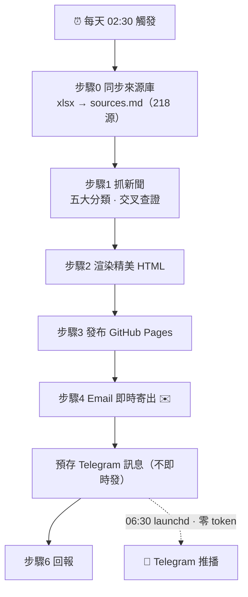
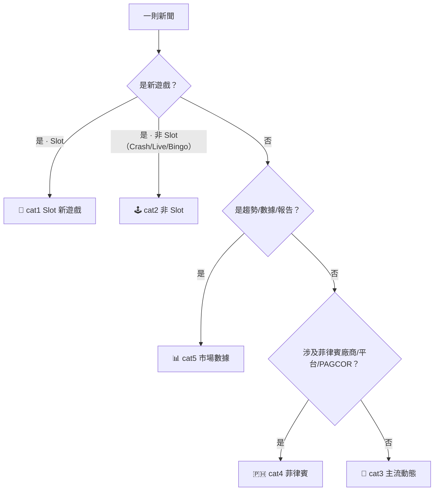
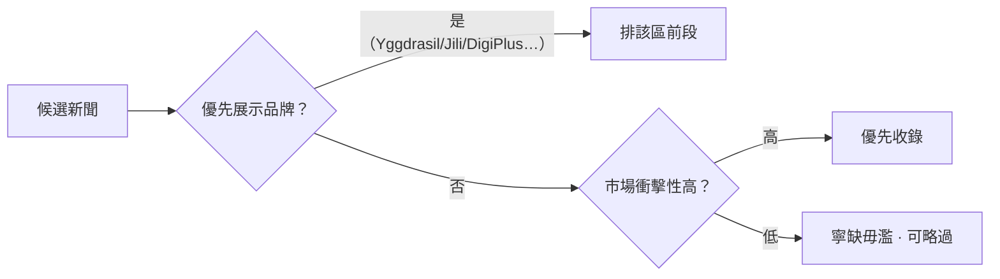
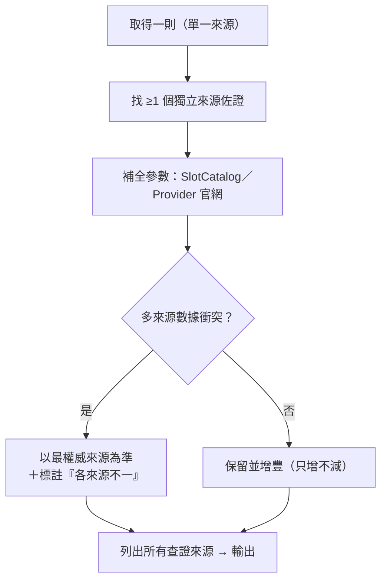
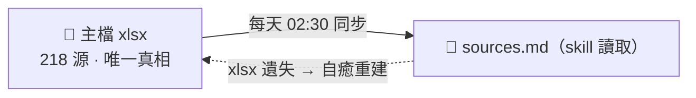

# 🎰 iGaming 市場日報 — OutputLogic（運作說明）

> 本頁記錄「iGaming 市場日報」如何自動生成、涵蓋哪些來源、用什麼邏輯判斷與排序，作為日後維護與查證的說明書。

## 一、生成的基本架構（約 300 字）

本日報為**全自動**產物：每天**台北時間 02:30** 由排程觸發（半夜跑，讓運算用量在上班前就退出額度視窗；Email 於 02:30 即時寄出，Telegram 通知則延到 **06:30** 由系統排程零額外成本發送）。流程先**同步來源庫**——以 Excel 主檔 igaming-daily-report-sources-v2.xlsx（目前 **218 個來源、10 大分類**）為唯一真相，重建成程式讀取的 sources.md；主檔若遺失會自動反向重建。接著**抓取新聞**：跨分類主動取材，被擋的站改用 Firecrawl（不觸發逐站授權），並依五大分類（🎰 Slot 新遊戲、🕹️ 非 Slot、🤝 主流動態、🇵🇭 菲律賓、📊 市場數據）歸位。**辨識與優先級**依序判斷：先分類，再看是否為「優先展示品牌」（Yggdrasil、Jili、DigiPlus 等）與市場衝擊性，高者排前、寧缺毋濫。每則都要**交叉查證**：至少再找一個獨立來源佐證、用官網／SlotCatalog 補全參數、遇數據衝突以最權威來源為準並標註——且**只增不減**，基本參數（盤面／倍率／RTP／波動）必須填滿。最後渲染成精美 HTML、發布 GitHub Pages，並附上「本日查詢約 N 個網站、提取 N 個來源交叉比對」的統計。

## 二、運作邏輯（流程圖）

### 2-1　每日總流程

### 2-2　新聞分類辨識

### 2-3　優先級判斷

### 2-4　交叉查證（只增不減）

### 2-5　來源庫維護（雙向同步 · 自癒）

## 三、資料來源總表（共 218 個，依主檔 xlsx 五欄呈現）

> 欄位：編號｜分類｜網站名稱｜網站網址｜備註。分類數量：Provider 官網 24、產品分析／評測 11、產業媒體 95、產業協會／技術認證機構 23、市場數據／分析公司 18、監理機關／官方數據 16、展會 19、論壇／社群 6、Podcast／影音 5、已停用 1。

### Provider 官網（24）

| 編號 | 網站名稱 | 網站網址 | 備註 |
|---|---|---|---|
| 1 | Pragmatic Play | [https://pragmaticplay.com/en/news/](https://pragmaticplay.com/en/news/) | Provider 官網 |
| 2 | PG Soft | [https://pgsoft.com/en/news/](https://pgsoft.com/en/news/) | Provider 官網 |
| 3 | Jili | [https://jiligames.com/](https://jiligames.com/) | Provider 官網 |
| 4 | Play'n GO | [https://www.playngo.com/](https://www.playngo.com/) | Provider 官網 |
| 5 | NetEnt | [https://www.netent.com/](https://www.netent.com/) | Provider 官網 |
| 6 | Red Tiger Gaming | [https://redtiger.com/](https://redtiger.com/) | Provider 官網 |
| 7 | Spribe | [https://spribe.co/](https://spribe.co/) | Provider 官網（Crash 代表廠商） |
| 8 | POP Ok (Popok Gaming) | [https://www.popokgaming.com/](https://www.popokgaming.com/) | Provider 官網 |
| 9 | Big Pot Gaming | [https://www.bigpotgaming.com/](https://www.bigpotgaming.com/) | Provider 官網 |
| 10 | Hacksaw Gaming | [https://hacksawgaming.com/](https://hacksawgaming.com/) | Provider 官網 |
| 11 | Nolimit City | [https://nolimitcity.com/](https://nolimitcity.com/) | Provider 官網 |
| 12 | Thunderkick | [https://www.thunderkick.com/](https://www.thunderkick.com/) | Provider 官網 |
| 13 | Big Time Gaming (BTG) | [https://www.bigtimegaming.com/](https://www.bigtimegaming.com/) | Provider 官網 |
| 14 | Yggdrasil Gaming | [https://www.yggdrasilgaming.com/](https://www.yggdrasilgaming.com/) | Provider 官網；⭐優先展示品牌 |
| 15 | Betsoft Gaming | [https://www.betsoft.com/](https://www.betsoft.com/) | Provider 官網 |
| 16 | Fantasma Games | [https://fantasmagames.com/](https://fantasmagames.com/) | Provider 官網 |
| 17 | ELK Studios | [https://elkstudios.com/](https://elkstudios.com/) | Provider 官網 |
| 18 | Print Studios | [https://www.printstudios.com/](https://www.printstudios.com/) | Provider 官網 |
| 19 | Relax Gaming | [https://www.relaxgaming.com/](https://www.relaxgaming.com/) | Provider 官網 |
| 20 | 4ThePlayer | [https://4theplayer.com/](https://4theplayer.com/) | Provider 官網 |
| 21 | AvatarUX | [https://avatarux.com/](https://avatarux.com/) | Provider 官網 |
| 22 | Kalamba Games | [https://kalambagames.com/](https://kalambagames.com/) | Provider 官網 |
| 23 | Peter & Sons | [https://peterandsonsgames.com/](https://peterandsonsgames.com/) | Provider 官網 |
| 24 | CP Game | [https://cpgames.com/](https://cpgames.com/) | Provider 官網 |

### 產品分析／評測（11）

| 編號 | 網站名稱 | 網站網址 | 備註 |
|---|---|---|---|
| 25 | Clash of Slots | [https://clashofslots.com](https://clashofslots.com) | bonus hit rate、variance、max multiplier 統計 |
| 26 | SlotCatalog — New Games | [https://slotcatalog.com/en/slots/new](https://slotcatalog.com/en/slots/new) | 全站新遊戲上線清單 |
| 27 | SlotCatalog — Jili | [https://slotcatalog.com/en/soft/Jili](https://slotcatalog.com/en/soft/Jili) | Jili 新遊戲、RTP、volatility 數據 |
| 28 | SlotCatalog — PG Soft | [https://slotcatalog.com/en/soft/PG-Soft](https://slotcatalog.com/en/soft/PG-Soft) | PG Soft 新遊戲、機制數據 |
| 29 | SlotCatalog — Pragmatic Play | [https://slotcatalog.com/en/soft/Pragmatic-Play](https://slotcatalog.com/en/soft/Pragmatic-Play) | PP 新遊戲、機制數據，含待發布排程 |
| 30 | Casino Guru | [https://casino.guru](https://casino.guru) | 遊戲機制解析、Provider 評測、玩家投訴資料庫 |
| 31 | AskGamblers | [https://www.askgamblers.com](https://www.askgamblers.com) | Slot variance 分析、Provider 評論 |
| 32 | iGamingToday | [https://www.igamingtoday.com](https://www.igamingtoday.com) | Provider 新聞角度的評測與分析 |
| 33 | Gamingsoft Blog | [https://www.gamingsoft.com/blog/](https://www.gamingsoft.com/blog/) | B2B 視角 Provider 評測，關注營運整合 |
| 34 | EZ Slot Design | [https://ezslotdesign.com/](https://ezslotdesign.com/) | Slot 遊戲設計分析，設計師視角拆解玩法機制 |
| 35 | P-WORLD | [https://www.p-world.co.jp/](https://www.p-world.co.jp/) | 日本遊技機資料庫；子頁 introduce_calendar.cgi 為★新台上市日期／規格／導入店數，日本機種情報最關鍵單一來源 |

### 產業媒體（95）

| 編號 | 網站名稱 | 網站網址 | 備註 |
|---|---|---|---|
| 36 | AGB（Asia Gaming Brief） | [https://agbrief.com](https://agbrief.com) | 東南亞 iGaming 專業媒體，Jili 報導最完整 |
| 37 | iGaming Business | [https://igamingbusiness.com/news/](https://igamingbusiness.com/news/) | Provider 合作、盤口動向、市場數據 |
| 38 | CasinoBeats | [https://casinobeats.com](https://casinobeats.com) | Provider 新遊戲、合作消息 |
| 39 | SBC News | [https://sbcnews.co.uk](https://sbcnews.co.uk) | 盤口動態、Provider 合作 |
| 40 | Gambling Insider | [https://gamblinginsider.com/news/](https://gamblinginsider.com/news/) | 盤口市場數據、M&A、財務動態 |
| 41 | Yogonet International | [https://www.yogonet.com/international/](https://www.yogonet.com/international/) | 全球市場動態、M&A（每日主力來源之一） |
| 42 | EGR Global | [https://egr.global/news/](https://egr.global/news/) | 盤口排名、Provider 表現 |
| 43 | Business of iGaming | [https://www.businessofigaming.com/provider-power-ranking/](https://www.businessofigaming.com/provider-power-ranking/) | Provider 市場佔比 power ranking |
| 44 | iGaming Expert | [https://igamingexpert.com](https://igamingexpert.com) | Provider 動態新聞 |
| 45 | iGaming.news — Slots | [https://igaming.news/category/slots/](https://igaming.news/category/slots/) | Slot 分類快訊 |
| 46 | Yogonet — Pragmatic Play 專頁 | [https://www.yogonet.com/international/topics/pragmatic-play/](https://www.yogonet.com/international/topics/pragmatic-play/) | 按 Provider 分類的新聞彙整 |
| 47 | CDC Gaming | [https://cdcgaming.com/](https://cdcgaming.com/) | 美國博彩媒體，含 Provider 與市場報導 |
| 48 | NEXT.io | [https://next.io/news/](https://next.io/news/) | 業內分析，含 Provider 產品設計深度文章 |
| 49 | Stake Blog | [https://stake.com/blog](https://stake.com/blog) | 現金網官方公告，需瀏覽器模式抓取 |
| 50 | iGB – Casino Games | [https://igamingbusiness.com/casino-games/](https://igamingbusiness.com/casino-games/) | Slot／Provider 產品線報導；iGaming Business 子版 |
| 51 | iGB – Publications | [https://igamingbusiness.com/publications/](https://igamingbusiness.com/publications/) | iGaming Business 深度專刊庫 |
| 52 | SBC Americas | [https://sbcamericas.com/](https://sbcamericas.com/) | SBC News 北美／LatAm 版 |
| 53 | EGR Intel | [https://www.egr.global/intel/](https://www.egr.global/intel/) | EGR Global 深度分析／高階訪談 |
| 54 | Gaming Intelligence | [https://www.gamingintelligence.com/](https://www.gamingintelligence.com/) | 高階產業情報媒體 |
| 55 | Global Gaming Insider | [https://globalgaminginsider.com/](https://globalgaminginsider.com/) | B2B／供應商動態 |
| 56 | InterGame Online | [https://www.intergameonline.com/](https://www.intergameonline.com/) | Online＋Land-based 綜合報導 |
| 57 | InterGame – iGaming Products | [https://www.intergameonline.com/igaming/products](https://www.intergameonline.com/igaming/products) | 線上 Slot 新品發表（與 cat1 高度對應） |
| 58 | InterGame – Land-based Products | [https://www.intergameonline.com/land-based-gaming/products](https://www.intergameonline.com/land-based-gaming/products) | 實體機台／Cabinet 新品發表 |
| 59 | G3 Newswire | [https://g3newswire.com/](https://g3newswire.com/) | 全球供應商／機台新聞，含 Aristocrat、L&W、IGT 等新品；子頁 g3newswire.com/magazines/ 為深度雜誌 |
| 60 | GGB Magazine | [https://ggbmagazine.com/](https://ggbmagazine.com/) | 北美實體 Slot／Casino Floor；子頁 /publications/ 與 /publications/ggb-magazine/ 為專刊庫 |
| 61 | Focus Gaming News | [https://focusgn.com/](https://focusgn.com/) | Provider 新遊戲更新速度快；另有地區版 Africa／Asia Pacific／Brasil／Latinoamérica（見下列各行） |
| 62 | Gaming International Online | [https://gaminginternational.online/](https://gaminginternational.online/) | Slot、game development 專題 |
| 63 | Casino International | [https://casinointernational-online.com/](https://casinointernational-online.com/) | 實體 Slot／Supplier 報導 |
| 64 | Casino Life Magazine | [https://www.casinolifemagazine.com/](https://www.casinolifemagazine.com/) | Casino／Supplier 產業雜誌 |
| 65 | Gaming & Leisure | [https://mygamingandleisure.com/](https://mygamingandleisure.com/) | Casino Technology 報導 |
| 66 | Indian Gaming | [https://www.indiangaming.com/](https://www.indiangaming.com/) | 北美 Tribal Casino；子頁 /magazine/ 為雜誌版 |
| 67 | iGaming Future | [https://igamingfuture.com/](https://igamingfuture.com/) | Technology／Product 報導；子頁 /category/casino/ 為 Casino／Slot 專區（優先級較高） |
| 68 | iGaming Enquirer | [https://igamingenquirer.com/](https://igamingenquirer.com/) | B2B／訪談；子頁 /news/ 為 Supplier／Product 新聞 |
| 69 | Times of Casino | [https://www.timesofcasino.com/](https://www.timesofcasino.com/) | Slot Launch 報導 |
| 70 | Casino Guru News | [https://casino.guru/news](https://casino.guru/news) | Casino Guru 新聞版（與已收錄的 Casino Guru 評測庫互補） |
| 71 | Casino Guru Interviews | [https://casino.guru/news/in-depth/interviews](https://casino.guru/news/in-depth/interviews) | Provider 高階主管長訪，格式獨特 |
| 72 | Casino Reports | [https://www.casinoreports.com/](https://www.casinoreports.com/) | 北美 iGaming 報導；子頁 /news/ 為新聞版 |
| 73 | Casino Reports Canada | [https://www.casinoreports.ca/category/casino-news/](https://www.casinoreports.ca/category/casino-news/) | 加拿大 Online Casino 專版 |
| 74 | European Gaming | [https://europeangaming.eu/portal/](https://europeangaming.eu/portal/) | 歐洲 B2B 產業媒體 |
| 75 | SiGMA News | [https://sigma.world/news/](https://sigma.world/news/) | SiGMA 新聞版（既有清單僅收錄展會頁）；另有繁中／俄語版 |
| 76 | Yogonet Latinoamérica | [https://www.yogonet.com/latinoamerica/](https://www.yogonet.com/latinoamerica/) | Yogonet 拉美版 |
| 77 | Yogonet Brasil | [https://www.yogonet.com/brasil/](https://www.yogonet.com/brasil/) | Yogonet 巴西版（PT-BR） |
| 78 | SoloAzar | [https://www.soloazar.com/](https://www.soloazar.com/) | 西語／英語拉美博彩媒體 |
| 79 | Zona de Azar | [https://zonadeazar.com/](https://zonadeazar.com/) | LatAm Provider、Game launch 報導 |
| 80 | InfoPlay | [https://www.infoplay.info/](https://www.infoplay.info/) | 西語博彩媒體 |
| 81 | AZARplus | [https://www.azarplus.com/](https://www.azarplus.com/) | 西語博彩媒體 |
| 82 | Sector del Juego | [https://sectordeljuego.com/](https://sectordeljuego.com/) | 西語博彩產業媒體 |
| 83 | El Recreativo | [https://www.elrecreativo.com/](https://www.elrecreativo.com/) | 西語 Land-based 報導 |
| 84 | Revista Casino Perú | [https://www.revistacasinoperu.com/](https://www.revistacasinoperu.com/) | 秘魯／拉美博彩雜誌 |
| 85 | Revista Apuesta Colombia | [https://apuestacolombia.com.co/](https://apuestacolombia.com.co/) | 哥倫比亞博彩雜誌 |
| 86 | SBC Noticias | [https://sbcnoticias.com/](https://sbcnoticias.com/) | SBC News 西語版；子頁 /br/ 為巴西葡語版 |
| 87 | SBC Notícias Brasil | [https://sbcnoticias.com/br/](https://sbcnoticias.com/br/) | SBC News 巴西葡語版 |
| 88 | iGaming Brazil | [https://igamingbrazil.com/](https://igamingbrazil.com/) | 巴西 iGaming 專業媒體 |
| 89 | Games Magazine Brasil | [https://gamesbras.com/](https://gamesbras.com/) | 巴西遊戲產業雜誌 |
| 90 | GiocoNews | [https://www.gioconews.it/](https://www.gioconews.it/) | 義大利博彩媒體 |
| 91 | AGIMEG | [https://www.agimeg.it/](https://www.agimeg.it/) | 義大利博彩媒體 |
| 92 | AgiproNews | [https://www.agipronews.it/](https://www.agipronews.it/) | 義大利 Slot、Provider 排名；子頁 /slot-e-vlt/ 為 Slot／VLT 專區 |
| 93 | PressGiochi | [https://www.pressgiochi.it/](https://www.pressgiochi.it/) | 義大利博彩媒體 |
| 94 | Online Gambling Quarterly | [https://www.ogqnews.com/](https://www.ogqnews.com/) | 英語歐洲研究型季刊 |
| 95 | AutomatenMarkt | [https://www.automatenmarkt.de/](https://www.automatenmarkt.de/) | 德國實體 Gaming 媒體 |
| 96 | AutomatenMarkt – Produkte | [https://www.automatenmarkt.de/produkte](https://www.automatenmarkt.de/produkte) | ★德國新機／Field Test 專區，最具追蹤價值 |
| 97 | Games & Business | [https://www.gamesundbusiness.de/](https://www.gamesundbusiness.de/) | 德國 B2B 媒體 |
| 98 | ISA-GUIDE | [https://www.isa-guide.de/](https://www.isa-guide.de/) | 德語 Casino 媒體 |
| 99 | Journal des Casinos | [https://www.journaldescasinos.com/](https://www.journaldescasinos.com/) | 法國 Casino B2B 媒體 |
| 100 | LesCasinos.org | [https://www.lescasinos.org/](https://www.lescasinos.org/) | 法國 Casino 媒體 |
| 101 | CasinoNieuws.nl | [https://www.casinonieuws.nl/](https://www.casinonieuws.nl/) | 荷蘭博彩媒體 |
| 102 | Gaming in Holland | [https://gaminginholland.com/](https://gaminginholland.com/) | 荷蘭／英語博彩媒體 |
| 103 | GBC Time | [https://gbc-time.com/](https://gbc-time.com/) | 英／俄／烏語博彩媒體 |
| 104 | Casino Inside Romania | [https://casinoinside.ro/](https://casinoinside.ro/) | 羅馬尼亞博彩媒體 |
| 105 | Casino Life & Business Romania | [https://www.casino-life.ro/](https://www.casino-life.ro/) | 羅馬尼亞／中東歐博彩媒體 |
| 106 | Interplay Poland | [https://interplay.pl/](https://interplay.pl/) | 波蘭博彩媒體 |
| 107 | GreenBelt | [https://web-greenbelt.jp/](https://web-greenbelt.jp/) | 日本 Pachislot 媒體；子頁 /category/machine/ 為新台專區（優先級最高） |
| 108 | Amusement Japan | [https://amusement-japan.co.jp/](https://amusement-japan.co.jp/) | 日本業界月刊 |
| 109 | 遊技日本 | [https://yugi-nippon.com/](https://yugi-nippon.com/) | Pachinko／Slot 綜合媒體；子頁 /pachinko-pachislot-kentei/ 為新機審查／型號資訊 |
| 110 | PiDEA X | [https://www.pidea.jp/](https://www.pidea.jp/) | 日本產業媒體 |
| 111 | 遊技通信 | [https://www.yugitsushin.jp/](https://www.yugitsushin.jp/) | 日本 B2B 媒體 |
| 112 | パチンコビレッジ | [https://www.pachinkovillage.com/](https://www.pachinkovillage.com/) | 日本機種／玩法媒體 |
| 113 | 情報島 | [https://johojima.com/](https://johojima.com/) | 日本 Hall／新機資訊 |
| 114 | PlayGraph | [https://www.play-graph.com/](https://www.play-graph.com/) | 日本遊技專門誌 |
| 115 | Pachinko Media Portal | [https://www.pmp-paa.com/](https://www.pmp-paa.com/) | 日本業界情報入口網 |
| 116 | GGRAsia | [https://www.ggrasia.com/](https://www.ggrasia.com/) | 澳門／亞洲 Casino floor 報導 |
| 117 | Inside Asian Gaming | [https://www.asgam.com/](https://www.asgam.com/) | 亞洲供應商、機台、展會報導 |
| 118 | AGB Macau | [https://agbrief.com/category/news/macau/](https://agbrief.com/category/news/macau/) | AGB 澳門專版 |
| 119 | AGB Philippines | [https://agbrief.com/category/news/philippines/](https://agbrief.com/category/news/philippines/) | ★AGB 菲律賓專版，直接對應本報告 🇵🇭 分類 |
| 120 | AGB Vietnam | [https://agbrief.com/category/news/vietnam/](https://agbrief.com/category/news/vietnam/) | AGB 越南專版 |
| 121 | Macau Business | [https://www.macaubusiness.com/](https://www.macaubusiness.com/) | 澳門商業／博彩媒體（EN／PT） |
| 122 | Macau Daily Times | [https://macaudailytimes.com.mo/](https://macaudailytimes.com.mo/) | 澳門日報英文版 |
| 123 | iGaming AFRIKA | [https://igamingafrika.com/](https://igamingafrika.com/) | 非洲 B2B 媒體 |
| 124 | AGE Insight | [https://insight.ageafrique.org/](https://insight.ageafrique.org/) | 非洲市場分析子站 |
| 125 | Gaming for Africa | [http://www.gfamagazine.com/](http://www.gfamagazine.com/) | 非洲 B2B 雜誌 |
| 126 | Find More Africa | [https://findmoreafrica.com/](https://findmoreafrica.com/) | 非洲博彩媒體；子頁含東非專版 |
| 127 | Focus Gaming News Africa | [https://focusgn.com/category/africa](https://focusgn.com/category/africa) | Focus Gaming News 非洲版 |
| 128 | Focus Asia Pacific iGaming | [https://focusgn.com/asia-pacific/category/igaming-news](https://focusgn.com/asia-pacific/category/igaming-news) | ★Focus Gaming News 亞太版，對應本報告亞洲焦點 |
| 129 | Focus Gaming News Brasil | [https://focusgn.com/brasil/](https://focusgn.com/brasil/) | Focus Gaming News 巴西版 |
| 130 | Focus Gaming News Latinoamérica | [https://focusgn.com/latinoamerica/](https://focusgn.com/latinoamerica/) | Focus Gaming News 拉美西語版 |

### 產業協會／技術認證機構（23）

| 編號 | 網站名稱 | 網站網址 | 備註 |
|---|---|---|---|
| 195 | AGEM Index | [https://www.agem.org/agem-index/](https://www.agem.org/agem-index/) | 美國博彩設備商協會（AGEM）產業指數 |
| 196 | AGEM News | [https://www.agem.org/news/](https://www.agem.org/news/) | AGEM 新聞版 |
| 197 | GLI Standards | [https://gaminglabs.com/gli-standards/](https://gaminglabs.com/gli-standards/) | Gaming Laboratories International 技術標準；子頁 /igaming/igaming-technical-standards/ 與中文版為 iGaming 專屬技術標準 |
| 198 | International Gaming Standards Association | [https://igsa.org/](https://igsa.org/) | 博彩通訊協定國際標準組織 |
| 199 | BMM Testlabs | [https://bmm.com/](https://bmm.com/) | 第三方遊戲測試／認證機構 |
| 200 | American Gaming Association Research | [https://www.americangaming.org/research/](https://www.americangaming.org/research/) | 美國博彩協會（AGA）研究部門 |
| 201 | AGA State of the States | [https://www.americangaming.org/resources/state-of-the-states/](https://www.americangaming.org/resources/state-of-the-states/) | AGA 年度旗艦市場報告 |
| 202 | Jdigital | [https://www.jdigital.es/](https://www.jdigital.es/) | 西班牙數位博彩產業協會 |
| 203 | ANESAR | [https://www.anesar.com/](https://www.anesar.com/) | 西班牙遊藝廳／自動機協會 |
| 204 | CEJUEGO | [https://cejuego.com/](https://cejuego.com/) | 西班牙博彩業聯合會 |
| 205 | Club de Convergentes | [https://clubdeconvergentes.es/](https://clubdeconvergentes.es/) | 西班牙機台供應鏈俱樂部 |
| 206 | JAMMA | [https://www.jamma.it/](https://www.jamma.it/) | 義大利娛樂機台協會；子頁 /apparecchi-intrattenimento 為設備分類頁 |
| 207 | Sistema Gioco Italia | [https://sistemagiocoitalia.it/](https://sistemagiocoitalia.it/) | 義大利博彩產業協會 |
| 208 | Deutsche Automatenwirtschaft | [https://www.automatenwirtschaft.de/](https://www.automatenwirtschaft.de/) | 德國機台產業協會 |
| 209 | VDAI | [https://www.vdai.de/](https://www.vdai.de/) | 德國機台製造商協會 |
| 210 | Casinos de France | [https://casinos.fr/](https://casinos.fr/) | 法國賭場協會 |
| 211 | 日本電動式遊技機工業協同組合 | [https://www.nichidenkyo.or.jp/](https://www.nichidenkyo.or.jp/) | 日本 Pachislot 廠商協同組合 |
| 212 | 日本遊技機工業組合 | [https://nikkoso.jp/](https://nikkoso.jp/) | 日本遊技機製造商工業組合 |
| 213 | Korea Casino Association | [https://www.koreacasino.or.kr/](https://www.koreacasino.or.kr/) | 韓國賭場協會 |
| 214 | Gaming Technologies Association | [https://www.gamingta.com/](https://www.gamingta.com/) | 澳洲機台製造商協會 |
| 215 | Australasian Gaming Council | [https://austgamingcouncil.org.au/](https://austgamingcouncil.org.au/) | 澳洲博彩產業研究協會 |
| 216 | AIEJA | [https://aieja.org.mx/](https://aieja.org.mx/) | 墨西哥博彩產業協會 |
| 217 | CIBELAE | [https://cibelae.net/](https://cibelae.net/) | 拉丁美洲暨伊比利半島博彩監理機關聯盟（監理機關組成的跨國協會） |

### 市場數據／分析公司（18）

| 編號 | 網站名稱 | 網站網址 | 備註 |
|---|---|---|---|
| 177 | Eilers & Krejcik Gaming（新網域） | [https://ekgamingllc.com/](https://ekgamingllc.com/) | ★EKG 官方新網域（原 ekg.com 已停站，見既有清單「已停用」項）；子頁 /reports 為報告庫、/services/game-performance-analytics 為單款 Slot／Cabinet 真實績效服務 |
| 178 | Eilers-Fantini Game Performance Reports（各區域月報） | [https://ekgamingllc.com/reports](https://ekgamingllc.com/reports) | 涵蓋 EMEA／LatAm／歐洲線上／美國線上／加拿大線上等區域月度 Slot／Cabinet 排名報告，逐月更新，請至 reports 頁查最新版而非收錄單一 PDF 連結 |
| 179 | UNLV Gaming Research & Review Journal | [https://oasis.library.unlv.edu/grrj/](https://oasis.library.unlv.edu/grrj/) | 美國內華達大學拉斯維加斯分校博彩學術期刊，Slot 玩家與機率研究 |
| 180 | UNLV Gaming Research Infographics | [https://oasis.library.unlv.edu/gaming_infographics/](https://oasis.library.unlv.edu/gaming_infographics/) | UNLV Gaming Statistics 圖表化摘要 |
| 181 | H2 Gambling Capital | [https://h2gc.com/](https://h2gc.com/) | 全球博彩市場數據庫，付費情報服務 |
| 182 | Vixio | [https://www.vixio.com/](https://www.vixio.com/) | Market Intelligence／法規情報服務 |
| 183 | Regulus Partners | [https://reguluspartners.com/](https://reguluspartners.com/) | 博彩產業策略顧問／情報 |
| 184 | Spectrum Gaming Group | [https://spectrumgaming.com/](https://spectrumgaming.com/) | Casino 產業顧問公司 |
| 185 | nQube Data Science | [https://www.nqubedatascience.com/](https://www.nqubedatascience.com/) | Slot Floor Analytics，實體機台效能分析 |
| 186 | Tangam Systems | [https://www.tangamsystems.com/](https://www.tangamsystems.com/) | Casino Floor Analytics |
| 187 | Gaming Analytics | [https://gaminganalytics.ai/](https://gaminganalytics.ai/) | AI／Slot Operations 分析服務 |
| 188 | Blask | [https://blask.com/](https://blask.com/) | Online Market Data 分析平台 |
| 189 | SOFTSWISS iGaming Trends | [https://www.softswiss.com/igaming-trends/](https://www.softswiss.com/igaming-trends/) | SOFTSWISS 年度趨勢報告微站 |
| 190 | Gambling Research Australia | [https://www.dss.gov.au/gambling/gambling-research/gambling-research-australia](https://www.dss.gov.au/gambling/gambling-research/gambling-research-australia) | 澳洲政府資助博彩學術研究計畫 |
| 191 | Australian Gambling Research Centre | [https://aifs.gov.au/research/areas/gambling](https://aifs.gov.au/research/areas/gambling) | 澳洲家庭研究院博彩研究中心 |
| 192 | BNLData | [https://bnldata.com.br/](https://bnldata.com.br/) | 巴西／拉美 Slot 市場數據；子頁 /category/slot/ 為 Slot 專區 |
| 193 | SLEC Africa Insights | [https://www.slecafrica.com/insights](https://www.slecafrica.com/insights) | 非洲市場情報與分析 |
| 194 | Gambling Research – Skill-based Gaming Machines（PDF） | [https://www.gamblingresearch.org.au/sites/default/files/2023-09/skill-based_gambling_in_australia_report_0.pdf](https://www.gamblingresearch.org.au/sites/default/files/2023-09/skill-based_gambling_in_australia_report_0.pdf) | 澳洲 Skill-based EGM 專題研究報告（單一 PDF，非持續更新頁面） |

### 監理機關／官方數據（16）

| 編號 | 網站名稱 | 網站網址 | 備註 |
|---|---|---|---|
| 161 | DGOJ Estudios e Informes | [https://www.ordenacionjuego.es/participantes-juego/informacion-estudios](https://www.ordenacionjuego.es/participantes-juego/informacion-estudios) | 西班牙官方博彩監理機關（DGOJ）研究與統計 |
| 162 | ADM Giochi | [https://www.adm.gov.it/portale/giochi](https://www.adm.gov.it/portale/giochi) | 義大利官方博彩監理機關（海關暨壟斷署） |
| 163 | ANJ Études et données | [https://anj.fr/](https://anj.fr/) | 法國官方博彩監理機關（Autorité Nationale des Jeux） |
| 164 | Kansspelautoriteit | [https://kansspelautoriteit.nl/](https://kansspelautoriteit.nl/) | 荷蘭官方博彩監理機關 |
| 165 | Belgian Gaming Commission | [https://www.gamingcommission.be/](https://www.gamingcommission.be/) | 比利時官方博彩監理機關 |
| 166 | Swiss Federal Gaming Board ESBK | [https://www.esbk.admin.ch/](https://www.esbk.admin.ch/) | 瑞士聯邦博彩監理機關 |
| 167 | Macau DICJ | [https://www.dicj.gov.mo/](https://www.dicj.gov.mo/) | 澳門官方博彩監察協調局 |
| 168 | PAGCOR Press Releases | [https://www.pagcor.ph/press-releases/index.php](https://www.pagcor.ph/press-releases/index.php) | ★菲律賓官方監理機關新聞稿，直接對應本報告 🇵🇭 分類 |
| 169 | PAGCOR Annual Reports | [https://www.pagcor.ph/transparency/annual-reports.php](https://www.pagcor.ph/transparency/annual-reports.php) | PAGCOR 年度報告，官方統計數據 |
| 170 | Coljuegos Sala de Prensa | [https://www.coljuegos.gov.co/publicaciones/300016/sala-de-prensa/](https://www.coljuegos.gov.co/publicaciones/300016/sala-de-prensa/) | 哥倫比亞官方博彩監理機關新聞室 |
| 171 | MINCETUR Perú | [https://www.gob.pe/mincetur](https://www.gob.pe/mincetur) | 秘魯外貿旅遊部（主管賭場）官方頁 |
| 172 | NSW Gaming Research Reports | [https://www.nsw.gov.au/business-and-economy/liquor-and-gaming/resources/research-and-evaluation-reports](https://www.nsw.gov.au/business-and-economy/liquor-and-gaming/resources/research-and-evaluation-reports) | 紐南威爾斯州政府博彩研究報告 |
| 173 | Liquor & Gaming NSW | [https://www.liquorandgaming.nsw.gov.au/](https://www.liquorandgaming.nsw.gov.au/) | 紐南威爾斯州官方博彩監理機關 |
| 174 | VGCCC | [https://www.vgccc.vic.gov.au/](https://www.vgccc.vic.gov.au/) | 維多利亞州官方博彩監理機關 |
| 175 | Queensland OLGR | [https://www.business.qld.gov.au/industries/hospitality-tourism-sport/liquor-gaming](https://www.business.qld.gov.au/industries/hospitality-tourism-sport/liquor-gaming) | 昆士蘭州官方博彩監理機關 |
| 176 | New Zealand DIA Gambling | [https://www.dia.govt.nz/Gambling](https://www.dia.govt.nz/Gambling) | 紐西蘭官方博彩監理機關 |

### 展會（19）

| 編號 | 網站名稱 | 網站網址 | 備註 |
|---|---|---|---|
| 137 | ICE Barcelona | [https://www.icegaming.com](https://www.icegaming.com) | 每年 1 月，全球最大 iGaming 展，有 content hub |
| 138 | SiGMA | [https://sigma.world](https://sigma.world) | 多地區（Malta、Manila、Rome 等） |
| 139 | G2E Las Vegas | [https://www.reiexpo.com/g2e](https://www.reiexpo.com/g2e) | 每年秋季，北美最大；⚠️官方新網域為 globalgamingexpo.com，建議之後更新 |
| 140 | ASEAN Gaming Summit | [https://aseangaming.com](https://aseangaming.com) | 東南亞；2026 停辦，2027 回歸 Manila |
| 141 | Asia Gaming Awards | [https://asiagamingawards.com](https://asiagamingawards.com) | 追蹤亞洲 Provider 得獎動態 |
| 142 | ezslotdesign — Gaming Expos | [https://ezslotdesign.com/gaming-expo/](https://ezslotdesign.com/gaming-expo/) | 展會資訊彙整，含 slot 設計視角 |
| 143 | Asia Gaming Expo (AGE) | [https://asiagaming-expo.com](https://asiagaming-expo.com) | 亞洲 Gaming 實體展會 |
| 144 | ICE Casino & Games | [https://www.icegaming.com/about-ice/sectors/casino](https://www.icegaming.com/about-ice/sectors/casino) | ICE 展會 Casino／Slot 產業別頁面 |
| 145 | ICE Exhibitor Products | [https://www.icegaming.com/exhibitor-product-listings/api-casino-games-integration](https://www.icegaming.com/exhibitor-product-listings/api-casino-games-integration) | ICE 展商新品發表庫 |
| 146 | G2E Asia | [https://www.g2easia.com/](https://www.g2easia.com/) | 亞洲實體 Casino／Slot 展會；子頁 en-gb/media/press-release.html 為新聞稿 |
| 147 | SiGMA Asia | [https://sigma.world/summits/asia/](https://sigma.world/summits/asia/) | SiGMA 亞洲分區峰會（含菲律賓 Manila）；另有繁中版 |
| 148 | GAT Expo | [https://gatexpo.net/](https://gatexpo.net/) | 西語／英語拉美展會 |
| 149 | Peru Gaming Show | [https://www.perugamingshow.com/](https://www.perugamingshow.com/) | 秘魯博彩展會 |
| 150 | SAGSE | [https://sagse.lat/](https://sagse.lat/) | 拉美大型博彩展會 |
| 151 | Australasian Gaming Expo | [https://austgamingexpo.com/](https://austgamingexpo.com/) | 澳洲實體機台展會 |
| 152 | iGaming AFRIKA Summit | [https://events.igasummit.com/](https://events.igasummit.com/) | 非洲博彩峰會 |
| 153 | Africa Gaming Expo | [https://www.ageafrique.org/](https://www.ageafrique.org/) | 非洲實體展會；子頁 /media/ 為報告／簡報下載庫 |
| 154 | SiGMA Africa | [https://sigma.world/summits/africa/](https://sigma.world/summits/africa/) | SiGMA 非洲分區峰會 |
| 155 | SiGMA South America | [https://sigma.world/summits/south-america/](https://sigma.world/summits/south-america/) | SiGMA 南美分區峰會 |

### 論壇／社群（6）

| 編號 | 網站名稱 | 網站網址 | 備註 |
|---|---|---|---|
| 131 | r/slots | [https://www.reddit.com/r/slots](https://www.reddit.com/r/slots) | 玩家討論 slot 遊戲體驗、Provider 產品反應 |
| 132 | r/onlinegambling | [https://www.reddit.com/r/onlinegambling](https://www.reddit.com/r/onlinegambling) | 廣泛討論 Provider 與盤口體驗 |
| 133 | AskGamblers Forum | [https://forum.askgamblers.com](https://forum.askgamblers.com) | 玩家＋業內討論，含 Provider 投訴與產品反應 |
| 134 | Mr. Gamble 論壇 — Provider 板 | [https://forum.mr-gamble.com/forum/4302-game-providers-exclusive-promos-news-discussions/](https://forum.mr-gamble.com/forum/4302-game-providers-exclusive-promos-news-discussions/) | 專屬 Game Provider 討論板，含促銷與新聞 |
| 135 | About Slots 論壇 | [https://forum.aboutslots.com/](https://forum.aboutslots.com/) | Slot 玩家論壇 |
| 136 | Casinomeister 論壇 | [https://www.casinomeister.com/forums/](https://www.casinomeister.com/forums/) | 老牌業界論壇，玩家＋業內人士混合 |

### Podcast／影音（5）

| 編號 | 網站名稱 | 網站網址 | 備註 |
|---|---|---|---|
| 156 | Clash of Slots YouTube | [https://www.youtube.com/c/ClashofSlots](https://www.youtube.com/c/ClashofSlots) | 大量 slot 試玩，觀察 bonus 觸發與遊戲行為 |
| 157 | iGaming Business YouTube | [https://www.youtube.com/user/iGamingBusiness1](https://www.youtube.com/user/iGamingBusiness1) | B2B 產業訪談、Provider 趨勢分析 |
| 158 | iGB Podcast | [https://igamingbusiness.com/podcasts/](https://igamingbusiness.com/podcasts/) | 市場分析，含 Provider 動態 |
| 159 | NEXT.io Podcast | [https://podcasts.apple.com/gb/podcast/next-io-podcast/id1515442333](https://podcasts.apple.com/gb/podcast/next-io-podcast/id1515442333) | 業內領袖訪談，聚焦 iGaming 產業策略 |
| 160 | iGaming Pulse | [https://podcasts.apple.com/us/podcast/igaming-pulse-trends-news-analysis/id1771798553](https://podcasts.apple.com/us/podcast/igaming-pulse-trends-news-analysis/id1771798553) | 產業趨勢與新聞分析 |

### 已停用（1）

| 編號 | 網站名稱 | 網站網址 | 備註 |
|---|---|---|---|
| 219 | Eilers & Krejcik Gaming (EKG)｜舊網域 | [https://ekg.com/news/](https://ekg.com/news/) | 舊網域已出售停站（2026-06-15 確認）；★本次比對發現公司已搬遷新網域 ekgamingllc.com，新網域資料已收錄於「市場數據／分析公司」分類，建議日後改用新網域 |

---
*本頁由 build_outputlogic.py 讀取主檔 xlsx 自動產生；來源異動後重跑即可更新。*
