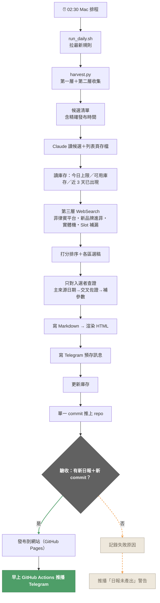
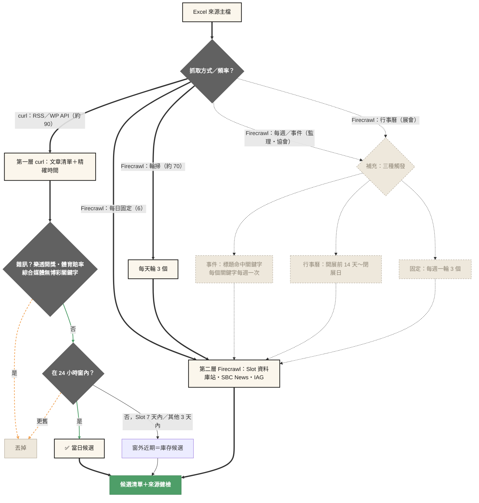
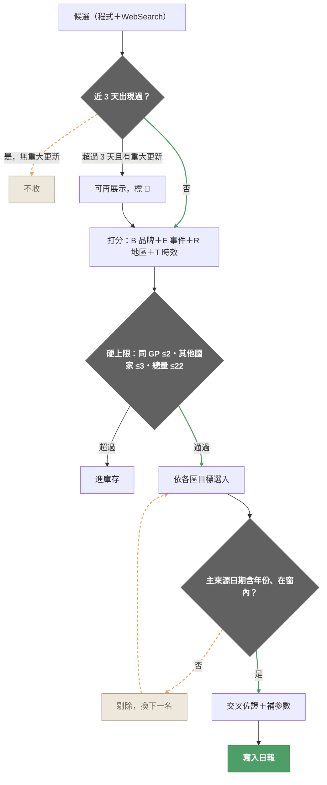
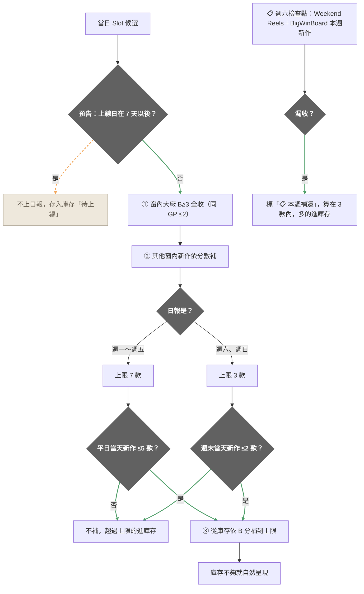
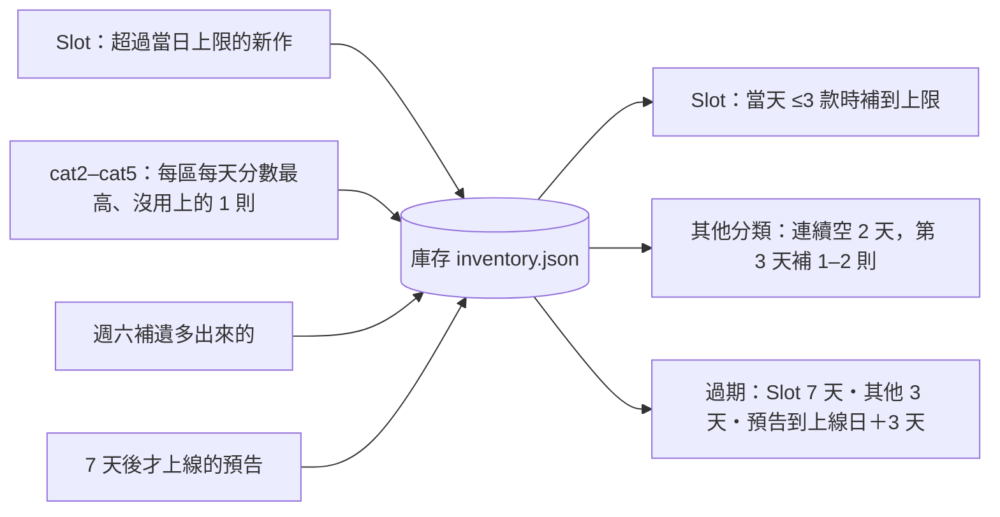

# 🎰 iGaming 市場日報 — OutputLogic（運作說明）

> 本頁記錄「iGaming 市場日報」如何自動生成、涵蓋哪些來源、用什麼邏輯判斷與排序。

## 一、生成的基本架構

本日報為**全自動**產物（規則版本 **v6.4.2**）：每天**台北時間 02:30** 由 Mac 排程啟動，從收集、選稿、查證到發布與推播，全程不需人工介入。

**① 收集：Claude 開工前，程式 harvest.py 先把當天的新聞收進來**

- **第一層｜RSS／WordPress API**：免費掃約 90 個來源，取得每篇文章**精確到分鐘的發布時間**
- **第二層｜Firecrawl**：抓沒有 API 的高價值站（Slot 資料庫站、SBC News、IAG），加上每日輪掃 3 站
- **補充｜三種觸發**：事件、行事曆、每週一固定週期，抓監理機關、協會與展會（小眾，數量少）
- **來源主檔**：Excel（目前 **233 個來源、10 大分類**），「抓取方式」「頻率」欄決定每個來源怎麼抓

**② 選稿：Claude 讀候選清單與庫存**

- **第三層｜WebSearch**：補程式抓不到的題目（菲律賓平台、新品牌進菲、實體機大廠、Slot 補漏）
- **打分**：品牌＋事件＋地區＋時效，套用 **3 天去重**與硬上限
- **Slot 區**：平日 7 款、週末 3 款；窗內大廠新作全收；平日當天新作 ≤5 款、週末 ≤2 款才從**庫存**補
- **特別版**：每週一、週四日報成功後，Slot 庫存 ≥5 款就另發一期釋放（最多 10 款，大廠在前）

**③ 查證：只對入選的新聞**

- **主來源日期關**：發布日期含年份，且落在 24 小時收集窗內
- **交叉查證**：至少一個獨立來源佐證，補齊盤面、倍率、RTP 等參數（只增不減）

**④ 發布與推播**

- 寫稿、渲染 HTML、寫 Telegram 預存訊息、更新庫存，以**單一 commit** 推上 repo
- 網站由 **GitHub Pages** 自動更新
- **Telegram** 由 GitHub Actions 在早上定時推播；當天沒有日報則改發「未產出」警告

## 二、運作邏輯（流程圖）

### 2-1　每日總流程

```mermaid
flowchart TD
  A["⏰ 02:30 Mac 排程"] --> B["run_daily.sh<br/>拉最新規則"]
  B --> C["harvest.py<br/>第一層＋第二層收集"]
  C --> D["候選清單<br/>含精確發布時間"]
  D --> E["Claude 讀候選＋列表頁存檔"]
  E --> F["讀庫存：今日上限／可用庫存／近 3 天已出現"]
  F --> G["第三層 WebSearch<br/>菲律賓平台・新品牌進菲・實體機・Slot 補漏"]
  G --> H["打分排序＋各區選稿"]
  H --> I["只對入選者查證<br/>主來源日期→交叉佐證→補參數"]
  I --> J["寫 Markdown → 渲染 HTML"]
  J --> K["寫 Telegram 預存訊息"]
  K --> L["更新庫存"]
  L --> M["單一 commit 推上 repo"]
  M --> N{"驗收：有新日報＋新 commit？"}
  N -- 是 --> O["發布到網站（GitHub Pages）"]
  N -- 否 --> X["記錄失敗原因"]
  O --> Q["早上 GitHub Actions 推播 Telegram"]
  X --> R["推播「日報未產出」警告"]
  classDef gate fill:#616161,stroke:#616161,color:#FFFFFF,font-weight:700
  classDef out fill:#4E9E68,stroke:#3C7F52,color:#FFFFFF,font-weight:700
  classDef muted fill:#EEE8DC,stroke:#A99F8E,color:#6F675A
  class N gate
  class Q out
  class X,R muted
  linkStyle 13 stroke:#4E9E68,stroke-width:2px
  linkStyle 14,16 stroke:#F2A65A,stroke-width:2px,stroke-dasharray:5 4
```

### 2-2　收集：網站內容怎麼抓、怎麼判斷

```mermaid
flowchart TD
  S["Excel 來源主檔"] ==> W{"抓取方式／頻率？"}
  W == "curl：RSS／WP API（約 90）" ==> L1["第一層 curl：文章清單＋精確時間"]
  W == "Firecrawl：每日固定（6）" ==> L2["第二層 Firecrawl：Slot 資料庫站・SBC News・IAG"]
  W == "Firecrawl：輪掃（約 70）" ==> RT["每天輪 3 個"]
  W -. "Firecrawl：每週／事件（監理・協會）" .-> TR{"補充：三種觸發"}
  W -. "Firecrawl：行事曆（展會）" .-> TR
  TR -.-> E1["事件：標題命中關鍵字<br/>每個關鍵字每週一次"]
  TR -.-> E2["行事曆：開展前 14 天～閉展日"]
  TR -.-> E3["固定：每週一輪 3 個"]
  RT ==> L2
  E1 -.-> L2
  E2 -.-> L2
  E3 -.-> L2
  L1 ==> NZ{"雜訊？樂透開獎・體育賠率<br/>綜合媒體無博彩關鍵字"}
  NZ -- 是 --> DROP["丟掉"]
  NZ == 否 ==> TW{"在 24 小時窗內？"}
  TW == 是 ==> IN["✅ 當日候選"]
  TW -- "否，Slot 7 天內／其他 3 天內" --> OLD["窗外近期＝庫存候選"]
  TW -- 更舊 --> DROP
  IN ==> OUT["候選清單＋來源健檢"]
  OLD --> OUT
  L2 ==> OUT
  classDef main fill:#FBF6EC,stroke:#1B1A18,stroke-width:2px,color:#1B1A18
  classDef minor fill:#EEE8DC,stroke:#A99F8E,stroke-dasharray:4 3,color:#8C8373
  class S,L1,L2,RT,IN main
  class TR,E1,E2,E3 minor
  classDef gate fill:#616161,stroke:#616161,color:#FFFFFF,font-weight:700
  classDef out fill:#4E9E68,stroke:#3C7F52,color:#FFFFFF,font-weight:700
  classDef muted fill:#EEE8DC,stroke:#A99F8E,color:#6F675A
  class NZ,TW,W gate
  class OUT out
  class DROP muted
  linkStyle 15,16 stroke:#4E9E68,stroke-width:2px
  linkStyle 14,18 stroke:#F2A65A,stroke-width:2px,stroke-dasharray:5 4
```

### 2-3　選稿：每則候選要過的關卡

```mermaid
flowchart TD
  C["候選（程式＋WebSearch）"] --> D{"近 3 天出現過？"}
  D -- "是，無重大更新" --> OUT1["不收"]
  D -- "超過 3 天且有重大更新" --> RE["可再展示，標 🔁"]
  D -- 否 --> SC["打分：B 品牌＋E 事件＋R 地區＋T 時效"]
  RE --> SC
  SC --> CAP{"硬上限：同 GP ≤2・其他國家 ≤3・總量 ≤22"}
  CAP -- 超過 --> STOCK["進庫存"]
  CAP -- 通過 --> PICK["依各區目標選入"]
  PICK --> V{"主來源日期含年份、在窗內？"}
  V -- 否 --> SWAP["剔除，換下一名"]
  SWAP --> PICK
  V -- 是 --> X["交叉佐證＋補參數"]
  X --> W["寫入日報"]
  classDef gate fill:#616161,stroke:#616161,color:#FFFFFF,font-weight:700
  classDef out fill:#4E9E68,stroke:#3C7F52,color:#FFFFFF,font-weight:700
  classDef muted fill:#EEE8DC,stroke:#A99F8E,color:#6F675A
  class CAP,D,V gate
  class W out
  class OUT1,SWAP muted
  linkStyle 3,7,11 stroke:#4E9E68,stroke-width:2px
  linkStyle 1,9,10 stroke:#F2A65A,stroke-width:2px,stroke-dasharray:5 4
```

### 2-4　Slot 區選法與庫存調用

```mermaid
flowchart TD
  A["當日 Slot 候選"] --> PV{"預告：上線日在 7 天以後？"}
  PV -- 是 --> LATER["不上日報，存入庫存「待上線」"]
  PV -- 否 --> BIG["① 窗內大廠 B≥3 全收（同 GP ≤2）"]
  BIG --> OTHER["② 其他窗內新作依分數補"]
  OTHER --> DAY{"日報是？"}
  DAY -- 週一～週五 --> C5["上限 7 款"]
  DAY -- 週六、週日 --> C2["上限 3 款"]
  C5 --> N{"平日當天新作 ≤5 款？"}
  C2 --> N2{"週末當天新作 ≤2 款？"}
  N -- 否 --> NOFILL["不補，超過上限的進庫存"]
  N2 -- 否 --> NOFILL
  N -- 是 --> FILL["③ 從庫存依 B 分補到上限"]
  N2 -- 是 --> FILL
  FILL --> NAT["庫存不夠就自然呈現"]
  SAT["📋 週六檢查點：Weekend Reels＋BigWinBoard 本週新作"] --> MISS{"漏收？"}
  MISS -- 是 --> BU["標「📋 本週補遺」，算在 3 款內，多的進庫存"]
  classDef gate fill:#616161,stroke:#616161,color:#FFFFFF,font-weight:700
  classDef out fill:#4E9E68,stroke:#3C7F52,color:#FFFFFF,font-weight:700
  classDef muted fill:#EEE8DC,stroke:#A99F8E,color:#6F675A
  class DAY,MISS,N,N2,PV gate
  class LATER muted
  linkStyle 2,9,10,11,12,15 stroke:#4E9E68,stroke-width:2px
  linkStyle 1 stroke:#F2A65A,stroke-width:2px,stroke-dasharray:5 4
```

### 2-5　庫存機制

```mermaid
flowchart LR
  I1["Slot：超過當日上限的新作"] --> INV[("庫存 inventory.json")]
  I2["cat2–cat5：每區每天分數最高、沒用上的 1 則"] --> INV
  I3["週六補遺多出來的"] --> INV
  I4["7 天後才上線的預告"] --> INV
  INV --> O1["Slot：當天 ≤3 款時補到上限"]
  INV --> O2["其他分類：連續空 2 天，第 3 天補 1–2 則"]
  INV --> EX["過期：Slot 7 天・其他 3 天・預告到上線日＋3 天"]
  classDef gate fill:#616161,stroke:#616161,color:#FFFFFF,font-weight:700
  classDef out fill:#4E9E68,stroke:#3C7F52,color:#FFFFFF,font-weight:700
  classDef muted fill:#EEE8DC,stroke:#A99F8E,color:#6F675A
```

## 三、四種找資料工具對比

|  | curl | Firecrawl | WebSearch | WebFetch |
|---|---|---|---|---|
| 是什麼 | 從 Mac 直接向網站要原始檔案 | 雲端服務，用真瀏覽器打開網頁再整理回傳 | 搜尋引擎，下關鍵字找全網 | Claude 內建的抓頁工具，抓完順便摘要 |
| 成本 | 免費 | 每次 1 點（月額度 1,000） | 免費（每天上限 60 次） | 免費 |
| 速度 | 快，90 個來源約 10 秒 | 慢，每分鐘最多 20 次 | 中等，每次數秒 | 中等，每次數秒 |
| 要知道網址嗎 | 要 | 要 | 不用，給關鍵字即可 | 要 |
| 需要 JavaScript 的網頁 | 拿到空殼 | 可以 | 不適用 | 常拿到空殼 |
| 防機器人的站 | 常被擋（403） | 多數能通過 | 不受影響 | 常被擋 |
| 發布時間 | RSS／WP API 精確到秒；一般網頁要自己找 | 附在標籤資料裡，常有 | 只有大概日期，常不準 | 要自己從內文判斷 |
| 回傳內容 | 原始碼、RSS、JSON，要自己解析 | 整理好的 markdown 或摘要，附配圖、發布時間 | 標題、網址、摘要片段 | 依提問整理過的摘要，看不到全文 |
| 主要風險 | 被擋、網頁改版就解析失敗 | 額度用完、速率限制 | 容易撈到舊聞、長青排行頁 | 摘要可能遺漏或誤讀細節 |
| 我們用在哪 | 第一層：RSS 約 30、WP API 約 60、BigWinBoard 新作列表 | 第二層列表頁、觸發來源、入選新聞的內文與配圖 | 第三層：菲律賓平台、新品牌進菲、實體機、Slot 補漏 | 備用：查證時抓一般網頁 |
| 判斷順序 | ① 有 RSS／WP API 或網頁抓得到就用它 | ③ curl 或 WebFetch 被擋才用 | ④ 來源清單以外的題目 | ② curl 不方便解析時的替代 |

## 三之一、工具 × 步驟對照

| 工具 | 出現在哪個步驟 | 流程圖位置 |
|---|---|---|
| curl | 第一層：抓 RSS、WP API，以及 BigWinBoard 新作列表 | 2-2「curl：RSS／WP API」分支（分支名稱寫的是資料格式，工具是 curl） |
| Firecrawl | 第二層：每日固定站、輪掃、三種觸發；查證時抓入選新聞的內文與配圖 | 2-2「Firecrawl：…」各分支；2-3 查證步驟 |
| WebSearch | 第三層：Claude 找來源清單以外的題目（菲律賓平台、新品牌進菲、實體機、Slot 補漏） | 2-1 總流程「第三層 WebSearch」（不在 2-2，因為不是照來源清單抓） |
| WebFetch | 查證時的備用工具 | 2-3「交叉佐證＋補參數」（不在 2-2） |

## 四、三種觸發（監理・協會・展會）

| 觸發 | 對象 | 條件 | 上限 |
|---|---|---|---|
| 事件觸發 | 監理機關（含 PAGCOR）、沒有 API 的協會 | 當天窗內新聞的標題命中該機構的關鍵字 → 抓官方頁當主來源／佐證；菲律賓、亞洲機構優先 | 每個關鍵字每週一次、每天最多 3 個 |
| 行事曆觸發 | 展會（依 Excel 展期） | 開展前 14 天～閉展日，每天抓該展會新聞頁 | 每天最多 2 個，開展日近者優先 |
| 固定週期 | 監理機關＋沒有 API 的協會 | 每週一（平日裡新聞最少的一天）輪 3 個 | 每週 3 個 |

## 五、日報結構：五大分類

| 分類 | 收什麼 | 每天數量 | 格式 |
|---|---|---|---|
| 🎰 cat1 Slot 新遊戲 | 線上老虎機新作、7 天內上線的預告、實體老虎機新機台 | 平日 ≤5、週末 ≤2 | 三段式：總述＋對 PM 的意義／衍生調整／參數 |
| 🕹️ cat2 非 Slot 新內容 | 小遊戲 → Live Game → 撲克 → 棋牌 → 其他；EEZE 每日固定 1 則 | 目標 2–3、上限 5 | 三段式，參數 3 或 5 欄 |
| 🤝 cat3 主流 GP／平台動態 | 大品牌具體動作：合作、併購、提告、運營；線上與實體機大廠 | 目標 3–5、上限 7 | 動態格式 |
| 🇵🇭 cat4 菲律賓 | 平台策略與新產品 ＞ 新品牌進菲 ＞ GP 上架 ＞ 政策 | 目標 2–4，商業 ≤6，官方另計 | 動態格式 |
| 📊 cat5 市場數據 & 趨勢 | 老虎機設計趨勢優先，其次市場數據、展會影響 | 目標 1–3、上限 5 | 市場格式 |

## 六、打分表

| 項目 | 分數 | 內容 |
|---|---|---|
| B 品牌 | 6／4／3／1／0 | 6：優先品牌 21 家（Acewin、Omiplay、YellowBat、ATG、EEZE、Yggdrasil、Jili、TaDa、DigiPlus 系、Stake、PAGCOR 等）；4：PG Soft、Pragmatic、Nolimit、Play'n GO、Red Tiger、Aristocrat、IGT、L&W；3：二線知名；1：其他 |
| E 事件 | 6／5.5／5／2／1／0.5 | 6：新遊戲上線、實體機首發、重大整合；5.5：新作預告；5：市場數據、玩法流行；2：展會；1：法規、M&A、財報；0.5：人事、獲獎、行銷 |
| R 地區 | 6／5／4／3／2／1 | 6：菲律賓；5：台灣、東南亞；4：拉美、巴西、全球；3：美國、歐洲；2：澳門、日韓、中國；1：其他 |
| T 時效 | +2／+1／0 | 窗內 0–12 小時 +2；12–24 小時 +1；只精確到日 0 |

## 七、資料來源總表（共 233 個）

> 欄位：編號｜網站名稱｜網站網址｜抓取方式｜頻率｜備註｜展期。分類數量：Provider 官網 27、產品分析／評測 13、產業媒體 102、產業協會／技術認證機構 23、市場數據／分析公司 18、監理機關／官方數據 16、展會 21、論壇／社群 6、Podcast／影音 5、已停用 2。

### Provider 官網（27）

| 編號 | 網站名稱 | 網站網址 | 抓取方式 | 頻率 | 備註 | 展期 |
|---|---|---|---|---|---|---|
| 1 | Pragmatic Play | [https://pragmaticplay.com/en/news/](https://pragmaticplay.com/en/news/) | WP-API | 每日 | Provider 官網 |  |
| 2 | PG Soft | [https://pgsoft.com/en/news/](https://pgsoft.com/en/news/) | Firecrawl | 輪掃 | Provider 官網 |  |
| 3 | Jili | [https://jiligames.com/](https://jiligames.com/) | Firecrawl | 輪掃 | Provider 官網 |  |
| 4 | Play'n GO | [https://www.playngo.com/](https://www.playngo.com/) | Sitemap | 每日 | Provider 官網；v6.5.2 官網改 Wix、RSS 消失 → 改抓 sitemap（/games/ 的日期＝上線日，/post/ 為新聞） |  |
| 5 | NetEnt | [https://www.netent.com/](https://www.netent.com/) | Firecrawl | 輪掃 | Provider 官網 |  |
| 6 | Red Tiger Gaming | [https://redtiger.com/](https://redtiger.com/) | Firecrawl | 輪掃 | Provider 官網 |  |
| 7 | Spribe | [https://spribe.co/](https://spribe.co/) | Firecrawl | 輪掃 | Provider 官網（Crash 代表廠商） |  |
| 8 | POP Ok (Popok Gaming) | [https://www.popokgaming.com/](https://www.popokgaming.com/) | Firecrawl | 輪掃 | Provider 官網 |  |
| 9 | Big Pot Gaming | [https://www.bigpotgaming.com/](https://www.bigpotgaming.com/) | Firecrawl | 輪掃 | Provider 官網 |  |
| 10 | Hacksaw Gaming | [https://hacksawgaming.com/](https://hacksawgaming.com/) | Firecrawl | 輪掃 | Provider 官網 |  |
| 11 | Nolimit City | [https://nolimitcity.com/](https://nolimitcity.com/) | Firecrawl | 輪掃 | Provider 官網 |  |
| 12 | Thunderkick | [https://www.thunderkick.com/](https://www.thunderkick.com/) | WP-API | 每日 | Provider 官網 |  |
| 13 | Big Time Gaming (BTG) | [https://www.bigtimegaming.com/](https://www.bigtimegaming.com/) | Firecrawl | 輪掃 | Provider 官網 |  |
| 14 | Yggdrasil Gaming | [https://www.yggdrasilgaming.com/](https://www.yggdrasilgaming.com/) | Firecrawl | 輪掃 | Provider 官網；⭐優先展示品牌 |  |
| 15 | Betsoft Gaming | [https://www.betsoft.com/](https://www.betsoft.com/) | RSS | 每日 | Provider 官網 |  |
| 16 | Fantasma Games | [https://fantasmagames.com/](https://fantasmagames.com/) | RSS | 每日 | Provider 官網 |  |
| 17 | ELK Studios | [https://elkstudios.com/](https://elkstudios.com/) | Firecrawl | 輪掃 | Provider 官網 |  |
| 18 | Print Studios | [https://www.printstudios.com/](https://www.printstudios.com/) | Firecrawl | 輪掃 | Provider 官網 |  |
| 19 | Relax Gaming | [https://www.relaxgaming.com/](https://www.relaxgaming.com/) | Firecrawl | 輪掃 | Provider 官網 |  |
| 20 | 4ThePlayer | [https://4theplayer.com/](https://4theplayer.com/) | WP-API | 每日 | Provider 官網 |  |
| 21 | AvatarUX | [https://avatarux.com/](https://avatarux.com/) | WP-API | 每日 | Provider 官網 |  |
| 22 | Kalamba Games | [https://kalambagames.com/](https://kalambagames.com/) | Firecrawl | 輪掃 | Provider 官網；v6.5.2 網站加了機器人驗證（curl 被擋）→ 改 Firecrawl 輪掃 |  |
| 23 | Peter & Sons | [https://peterandsonsgames.com/](https://peterandsonsgames.com/) | Firecrawl | 輪掃 | Provider 官網 |  |
| 24 | CP Game | [https://cpgames.com/](https://cpgames.com/) | Firecrawl | 輪掃 | Provider 官網 |  |
| 220 | Acewin | [https://www.acewin168.com/](https://www.acewin168.com/) | Firecrawl | 輪掃 | ★優先追蹤｜IGS鈊象電子旗下 GP；可視為 Jili 低配版、多款與 Jili 互通，B 端價格有優勢。上新遊戲於 DigiPlus 系(BingoPlus/ArenaPlus/GameZone)或 CasinoPlus 等菲現金網、或特別線上/線下活動與平台功能更新→提高露出權重 |  |
| 221 | Omiplay | [https://omiplay.com/](https://omiplay.com/) | Firecrawl | 輪掃 | ★優先追蹤｜台灣尊博集團 GP；Super Gem 對標 Fortune Gem 成功、獲 BingoPlus/CasinoPlus 內部認可、菲律賓有成績。上新遊戲於 DigiPlus 系/CasinoPlus 或特別活動/平台更新→提高露出權重 |  |
| 222 | YellowBat | [https://www.yellowbat.com/games/](https://www.yellowbat.com/games/) | WP-API | 每日 | ★優先追蹤｜菲律賓平台 PlayTime 深度策略夥伴。上新遊戲於 DigiPlus 系/CasinoPlus/PlayTime 或特別活動/平台更新→提高露出權重 |  |

### 產品分析／評測（13）

| 編號 | 網站名稱 | 網站網址 | 抓取方式 | 頻率 | 備註 | 展期 |
|---|---|---|---|---|---|---|
| 25 | Clash of Slots | [https://clashofslots.com](https://clashofslots.com) | WP-API | 每日 | bonus hit rate、variance、max multiplier 統計 |  |
| 26 | SlotCatalog — New Games | [https://slotcatalog.com/en/slots/new](https://slotcatalog.com/en/slots/new) | Firecrawl | 輪掃 | 全站新遊戲上線清單 |  |
| 27 | SlotCatalog — Jili | [https://slotcatalog.com/en/soft/Jili](https://slotcatalog.com/en/soft/Jili) | Firecrawl | 輪掃 | Jili 新遊戲、RTP、volatility 數據 |  |
| 28 | SlotCatalog — PG Soft | [https://slotcatalog.com/en/soft/PG-Soft](https://slotcatalog.com/en/soft/PG-Soft) | Firecrawl | 輪掃 | PG Soft 新遊戲、機制數據 |  |
| 29 | SlotCatalog — Pragmatic Play | [https://slotcatalog.com/en/soft/Pragmatic-Play](https://slotcatalog.com/en/soft/Pragmatic-Play) | Firecrawl | 輪掃 | PP 新遊戲、機制數據，含待發布排程 |  |
| 30 | Casino Guru | [https://casino.guru](https://casino.guru) | Firecrawl | 輪掃 | 遊戲機制解析、Provider 評測、玩家投訴資料庫 |  |
| 31 | AskGamblers | [https://www.askgamblers.com](https://www.askgamblers.com) | Firecrawl | 輪掃 | Slot variance 分析、Provider 評論 |  |
| 32 | iGamingToday | [https://www.igamingtoday.com](https://www.igamingtoday.com) | Firecrawl | 每日 | Provider 新聞角度的評測與分析 |  |
| 33 | Gamingsoft Blog | [https://www.gamingsoft.com/blog/](https://www.gamingsoft.com/blog/) | WP-API | 每日 | B2B 視角 Provider 評測，關注營運整合 |  |
| 34 | EZ Slot Design | [https://ezslotdesign.com/](https://ezslotdesign.com/) | RSS | 每日 | Slot 遊戲設計分析，設計師視角拆解玩法機制 |  |
| 35 | P-WORLD | [https://www.p-world.co.jp/](https://www.p-world.co.jp/) | Firecrawl | 輪掃 | 日本遊技機資料庫；子頁 introduce_calendar.cgi 為★新台上市日期／規格／導入店數，日本機種情報最關鍵單一來源 |  |
| 229 | BigWinBoard | [https://www.bigwinboard.com/new-slots/](https://www.bigwinboard.com/new-slots/) | 程式解析 | 每日 | Slot 資料庫站（v6.4 新增）；新作依上線日排序，大廠幾乎都有，含 RTP／最高倍率 |  |
| 230 | SlotsLaunch | [https://slotslaunch.com/](https://slotslaunch.com/) | 程式解析 | 每日 | Slot 資料庫站（v6.4 新增）；v6.5 改抓上線日曆（每款有上線日，免費） |  |

### 產業媒體（102）

| 編號 | 網站名稱 | 網站網址 | 抓取方式 | 頻率 | 備註 | 展期 |
|---|---|---|---|---|---|---|
| 36 | AGB（Asia Gaming Brief） | [https://agbrief.com](https://agbrief.com) | RSS | 每日 | 東南亞 iGaming 專業媒體，Jili 報導最完整 |  |
| 37 | iGaming Business | [https://igamingbusiness.com/news/](https://igamingbusiness.com/news/) | WP-API | 每日 | Provider 合作、盤口動向、市場數據 |  |
| 38 | CasinoBeats | [https://casinobeats.com](https://casinobeats.com) | WP-API | 每日 | Provider 新遊戲、合作消息 |  |
| 39 | SBC News | [https://sbcnews.co.uk](https://sbcnews.co.uk) | RSS | 每日 | 盤口動態、Provider 合作；v6.5 改用 RSS（10 則約 3 天，免費） |  |
| 40 | Gambling Insider | [https://gamblinginsider.com/news/](https://gamblinginsider.com/news/) | WP-API | 每日 | 盤口市場數據、M&A、財務動態 |  |
| 41 | Yogonet International | [https://www.yogonet.com/international/](https://www.yogonet.com/international/) | RSS | 每日 | 全球市場動態、M&A（每日主力來源之一） |  |
| 42 | EGR Global | [https://egr.global/news/](https://egr.global/news/) | RSS | 每日 | 盤口排名、Provider 表現 |  |
| 43 | Business of iGaming | [https://www.businessofigaming.com/provider-power-ranking/](https://www.businessofigaming.com/provider-power-ranking/) | WP-API | 每日 | Provider 市場佔比 power ranking |  |
| 44 | iGaming Expert | [https://igamingexpert.com](https://igamingexpert.com) | RSS | 每日 | Provider 動態新聞 |  |
| 45 | iGaming.news — Slots | [https://igaming.news/category/slots/](https://igaming.news/category/slots/) | Firecrawl | 輪掃 | Slot 分類快訊 |  |
| 46 | Yogonet — Pragmatic Play 專頁 | [https://www.yogonet.com/international/topics/pragmatic-play/](https://www.yogonet.com/international/topics/pragmatic-play/) | Firecrawl | 輪掃 | 按 Provider 分類的新聞彙整 |  |
| 47 | CDC Gaming | [https://cdcgaming.com/](https://cdcgaming.com/) | WP-API | 每日 | 美國博彩媒體，含 Provider 與市場報導 |  |
| 48 | NEXT.io | [https://next.io/news/](https://next.io/news/) | Firecrawl | 輪掃 | 業內分析，含 Provider 產品設計深度文章 |  |
| 49 | Stake Blog | [https://stake.com/blog](https://stake.com/blog) | Firecrawl | 輪掃 | 現金網官方公告，需瀏覽器模式抓取 |  |
| 50 | iGB – Casino Games | [https://igamingbusiness.com/casino-games/](https://igamingbusiness.com/casino-games/) | WP-API | 每日 | Slot／Provider 產品線報導；iGaming Business 子版 |  |
| 51 | iGB – Publications | [https://igamingbusiness.com/publications/](https://igamingbusiness.com/publications/) | WP-API | 每日 | iGaming Business 深度專刊庫 |  |
| 52 | SBC Americas | [https://sbcamericas.com/](https://sbcamericas.com/) | RSS | 每日 | SBC News 北美／LatAm 版 |  |
| 53 | EGR Intel | [https://www.egr.global/intel/](https://www.egr.global/intel/) | RSS | 每日 | EGR Global 深度分析／高階訪談 |  |
| 54 | Gaming Intelligence | [https://www.gamingintelligence.com/](https://www.gamingintelligence.com/) | WP-API | 每日 | 高階產業情報媒體 |  |
| 55 | Global Gaming Insider | [https://globalgaminginsider.com/](https://globalgaminginsider.com/) | Firecrawl | 輪掃 | B2B／供應商動態 |  |
| 56 | InterGame Online | [https://www.intergameonline.com/](https://www.intergameonline.com/) | Firecrawl | 輪掃 | Online＋Land-based 綜合報導 |  |
| 57 | InterGame – iGaming Products | [https://www.intergameonline.com/igaming/products](https://www.intergameonline.com/igaming/products) | Firecrawl | 輪掃 | 線上 Slot 新品發表（與 cat1 高度對應） |  |
| 58 | InterGame – Land-based Products | [https://www.intergameonline.com/land-based-gaming/products](https://www.intergameonline.com/land-based-gaming/products) | Firecrawl | 輪掃 | 實體機台／Cabinet 新品發表 |  |
| 59 | G3 Newswire | [https://g3newswire.com/](https://g3newswire.com/) | WP-API | 每日 | 全球供應商／機台新聞，含 Aristocrat、L&W、IGT 等新品；子頁 g3newswire.com/magazines/ 為深度雜誌 |  |
| 60 | GGB Magazine | [https://ggbmagazine.com/](https://ggbmagazine.com/) | Firecrawl | 輪掃 | 北美實體 Slot／Casino Floor；子頁 /publications/ 與 /publications/ggb-magazine/ 為專刊庫 |  |
| 61 | Focus Gaming News | [https://focusgn.com/](https://focusgn.com/) | RSS | 每日 | Provider 新遊戲更新速度快；另有地區版 Africa／Asia Pacific／Brasil／Latinoamérica（見下列各行） |  |
| 62 | Gaming International Online | [https://gaminginternational.online/](https://gaminginternational.online/) | WP-API | 每日 | Slot、game development 專題 |  |
| 63 | Casino International | [https://casinointernational-online.com/](https://casinointernational-online.com/) | WP-API | 每日 | 實體 Slot／Supplier 報導 |  |
| 64 | Casino Life Magazine | [https://www.casinolifemagazine.com/](https://www.casinolifemagazine.com/) | RSS | 每日 | Casino／Supplier 產業雜誌 |  |
| 65 | Gaming & Leisure | [https://mygamingandleisure.com/](https://mygamingandleisure.com/) | WP-API | 每日 | Casino Technology 報導 |  |
| 66 | Indian Gaming | [https://www.indiangaming.com/](https://www.indiangaming.com/) | WP-API | 每日 | 北美 Tribal Casino；子頁 /magazine/ 為雜誌版 |  |
| 67 | iGaming Future | [https://igamingfuture.com/](https://igamingfuture.com/) | RSS | 每日 | Technology／Product 報導；子頁 /category/casino/ 為 Casino／Slot 專區（優先級較高） |  |
| 68 | iGaming Enquirer | [https://igamingenquirer.com/](https://igamingenquirer.com/) | WP-API | 每日 | B2B／訪談；子頁 /news/ 為 Supplier／Product 新聞 |  |
| 69 | Times of Casino | [https://www.timesofcasino.com/](https://www.timesofcasino.com/) | RSS | 每日 | Slot Launch 報導 |  |
| 70 | Casino Guru News | [https://casino.guru/news](https://casino.guru/news) | Firecrawl | 輪掃 | Casino Guru 新聞版（與已收錄的 Casino Guru 評測庫互補） |  |
| 71 | Casino Guru Interviews | [https://casino.guru/news/in-depth/interviews](https://casino.guru/news/in-depth/interviews) | Firecrawl | 輪掃 | Provider 高階主管長訪，格式獨特 |  |
| 72 | Casino Reports | [https://www.casinoreports.com/](https://www.casinoreports.com/) | RSS | 每日 | 北美 iGaming 報導；子頁 /news/ 為新聞版 |  |
| 73 | Casino Reports Canada | [https://www.casinoreports.ca/category/casino-news/](https://www.casinoreports.ca/category/casino-news/) | WP-API | 每日 | 加拿大 Online Casino 專版 |  |
| 74 | European Gaming | [https://europeangaming.eu/portal/](https://europeangaming.eu/portal/) | RSS | 每日 | 歐洲 B2B 產業媒體 |  |
| 75 | SiGMA News | [https://sigma.world/news/](https://sigma.world/news/) | Firecrawl | 輪掃 | SiGMA 新聞版（既有清單僅收錄展會頁）；另有繁中／俄語版 |  |
| 76 | Yogonet Latinoamérica | [https://www.yogonet.com/latinoamerica/](https://www.yogonet.com/latinoamerica/) | Firecrawl | 輪掃 | Yogonet 拉美版 |  |
| 77 | Yogonet Brasil | [https://www.yogonet.com/brasil/](https://www.yogonet.com/brasil/) | Firecrawl | 輪掃 | Yogonet 巴西版（PT-BR） |  |
| 78 | SoloAzar | [https://www.soloazar.com/](https://www.soloazar.com/) | RSS | 每日 | 西語／英語拉美博彩媒體 |  |
| 79 | Zona de Azar | [https://zonadeazar.com/](https://zonadeazar.com/) | WP-API | 每日 | LatAm Provider、Game launch 報導 |  |
| 80 | InfoPlay | [https://www.infoplay.info/](https://www.infoplay.info/) | Firecrawl | 輪掃 | 西語博彩媒體 |  |
| 81 | AZARplus | [https://www.azarplus.com/](https://www.azarplus.com/) | WP-API | 每日 | 西語博彩媒體 |  |
| 82 | Sector del Juego | [https://sectordeljuego.com/](https://sectordeljuego.com/) | WP-API | 每日 | 西語博彩產業媒體 |  |
| 83 | El Recreativo | [https://www.elrecreativo.com/](https://www.elrecreativo.com/) | Firecrawl | 輪掃 | 西語 Land-based 報導 |  |
| 84 | Revista Casino Perú | [https://www.revistacasinoperu.com/](https://www.revistacasinoperu.com/) | WP-API | 每日 | 秘魯／拉美博彩雜誌 |  |
| 85 | Revista Apuesta Colombia | [https://apuestacolombia.com.co/](https://apuestacolombia.com.co/) | WP-API | 每日 | 哥倫比亞博彩雜誌 |  |
| 86 | SBC Noticias | [https://sbcnoticias.com/](https://sbcnoticias.com/) | RSS | 每日 | SBC News 西語版；子頁 /br/ 為巴西葡語版 |  |
| 87 | SBC Notícias Brasil | [https://sbcnoticias.com/br/](https://sbcnoticias.com/br/) | RSS | 每日 | SBC News 巴西葡語版 |  |
| 88 | iGaming Brazil | [https://igamingbrazil.com/](https://igamingbrazil.com/) | RSS | 每日 | 巴西 iGaming 專業媒體 |  |
| 89 | Games Magazine Brasil | [https://gamesbras.com/](https://gamesbras.com/) | Firecrawl | 輪掃 | 巴西遊戲產業雜誌 |  |
| 90 | GiocoNews | [https://www.gioconews.it/](https://www.gioconews.it/) | WP-API | 每日 | 義大利博彩媒體 |  |
| 91 | AGIMEG | [https://www.agimeg.it/](https://www.agimeg.it/) | WP-API | 每日 | 義大利博彩媒體 |  |
| 92 | AgiproNews | [https://www.agipronews.it/](https://www.agipronews.it/) | RSS | 每日 | 義大利 Slot、Provider 排名；子頁 /slot-e-vlt/ 為 Slot／VLT 專區 |  |
| 93 | PressGiochi | [https://www.pressgiochi.it/](https://www.pressgiochi.it/) | WP-API | 每日 | 義大利博彩媒體 |  |
| 94 | Online Gambling Quarterly | [https://www.ogqnews.com/](https://www.ogqnews.com/) | WP-API | 每日 | 英語歐洲研究型季刊 |  |
| 95 | AutomatenMarkt | [https://www.automatenmarkt.de/](https://www.automatenmarkt.de/) | RSS | 每日 | 德國實體 Gaming 媒體 |  |
| 96 | AutomatenMarkt – Produkte | [https://www.automatenmarkt.de/produkte](https://www.automatenmarkt.de/produkte) | RSS | 每日 | ★德國新機／Field Test 專區，最具追蹤價值 |  |
| 97 | Games & Business | [https://www.gamesundbusiness.de/](https://www.gamesundbusiness.de/) | WP-API | 每日 | 德國 B2B 媒體 |  |
| 98 | ISA-GUIDE | [https://www.isa-guide.de/](https://www.isa-guide.de/) | WP-API | 每日 | 德語 Casino 媒體 |  |
| 99 | Journal des Casinos | [https://www.journaldescasinos.com/](https://www.journaldescasinos.com/) | Firecrawl | 輪掃 | 法國 Casino B2B 媒體 |  |
| 100 | LesCasinos.org | [https://www.lescasinos.org/](https://www.lescasinos.org/) | RSS | 每日 | 法國 Casino 媒體 |  |
| 101 | CasinoNieuws.nl | [https://www.casinonieuws.nl/](https://www.casinonieuws.nl/) | Firecrawl | 輪掃 | 荷蘭博彩媒體 |  |
| 102 | Gaming in Holland | [https://gaminginholland.com/](https://gaminginholland.com/) | Firecrawl | 輪掃 | 荷蘭／英語博彩媒體 |  |
| 103 | GBC Time | [https://gbc-time.com/](https://gbc-time.com/) | Firecrawl | 輪掃 | 英／俄／烏語博彩媒體 |  |
| 104 | Casino Inside Romania | [https://casinoinside.ro/](https://casinoinside.ro/) | Firecrawl | 輪掃 | 羅馬尼亞博彩媒體；v6.5.2 網站加了機器人驗證（curl 被擋）→ 改 Firecrawl 輪掃 |  |
| 105 | Casino Life & Business Romania | [https://www.casino-life.ro/](https://www.casino-life.ro/) | Firecrawl | 輪掃 | 羅馬尼亞／中東歐博彩媒體 |  |
| 106 | Interplay Poland | [https://interplay.pl/](https://interplay.pl/) | WP-API | 每日 | 波蘭博彩媒體 |  |
| 107 | GreenBelt | [https://web-greenbelt.jp/](https://web-greenbelt.jp/) | WP-API | 每日 | 日本 Pachislot 媒體；子頁 /category/machine/ 為新台專區（優先級最高） |  |
| 108 | Amusement Japan | [https://amusement-japan.co.jp/](https://amusement-japan.co.jp/) | Firecrawl | 輪掃 | 日本業界月刊 |  |
| 109 | 遊技日本 | [https://yugi-nippon.com/](https://yugi-nippon.com/) | Firecrawl | 輪掃 | Pachinko／Slot 綜合媒體；子頁 /pachinko-pachislot-kentei/ 為新機審查／型號資訊 |  |
| 110 | PiDEA X | [https://www.pidea.jp/](https://www.pidea.jp/) | Firecrawl | 輪掃 | 日本產業媒體 |  |
| 111 | 遊技通信 | [https://www.yugitsushin.jp/](https://www.yugitsushin.jp/) | WP-API | 每日 | 日本 B2B 媒體 |  |
| 112 | パチンコビレッジ | [https://www.pachinkovillage.com/](https://www.pachinkovillage.com/) | Firecrawl | 輪掃 | 日本機種／玩法媒體 |  |
| 113 | 情報島 | [https://johojima.com/](https://johojima.com/) | Firecrawl | 輪掃 | 日本 Hall／新機資訊 |  |
| 114 | PlayGraph | [https://www.play-graph.com/](https://www.play-graph.com/) | Firecrawl | 輪掃 | 日本遊技專門誌 |  |
| 115 | Pachinko Media Portal | [https://www.pmp-paa.com/](https://www.pmp-paa.com/) | Firecrawl | 輪掃 | 日本業界情報入口網 |  |
| 116 | GGRAsia | [https://www.ggrasia.com/](https://www.ggrasia.com/) | WP-API | 每日 | 澳門／亞洲 Casino floor 報導 |  |
| 117 | Inside Asian Gaming | [https://www.asgam.com/](https://www.asgam.com/) | RSS | 每日 | 亞洲供應商、機台、展會報導；v6.5 改用 RSS（10 則約 3 天，免費） |  |
| 118 | AGB Macau | [https://agbrief.com/category/news/macau/](https://agbrief.com/category/news/macau/) | RSS | 每日 | AGB 澳門專版 |  |
| 119 | AGB Philippines | [https://agbrief.com/category/news/philippines/](https://agbrief.com/category/news/philippines/) | RSS | 每日 | ★AGB 菲律賓專版，直接對應本報告 🇵🇭 分類 |  |
| 120 | AGB Vietnam | [https://agbrief.com/category/news/vietnam/](https://agbrief.com/category/news/vietnam/) | RSS | 每日 | AGB 越南專版 |  |
| 121 | Macau Business | [https://www.macaubusiness.com/](https://www.macaubusiness.com/) | Firecrawl | 輪掃 | 澳門商業／博彩媒體（EN／PT） |  |
| 122 | Macau Daily Times | [https://macaudailytimes.com.mo/](https://macaudailytimes.com.mo/) | Firecrawl | 輪掃 | 澳門日報英文版 |  |
| 123 | iGaming AFRIKA | [https://igamingafrika.com/](https://igamingafrika.com/) | WP-API | 每日 | 非洲 B2B 媒體 |  |
| 124 | AGE Insight | [https://insight.ageafrique.org/](https://insight.ageafrique.org/) | WP-API | 每日 | 非洲市場分析子站 |  |
| 125 | Gaming for Africa | [http://www.gfamagazine.com/](http://www.gfamagazine.com/) | Firecrawl | 輪掃 | 非洲 B2B 雜誌 |  |
| 126 | Find More Africa | [https://findmoreafrica.com/](https://findmoreafrica.com/) | WP-API | 每日 | 非洲博彩媒體；子頁含東非專版 |  |
| 127 | Focus Gaming News Africa | [https://focusgn.com/category/africa](https://focusgn.com/category/africa) | RSS | 每日 | Focus Gaming News 非洲版 |  |
| 128 | Focus Asia Pacific iGaming | [https://focusgn.com/asia-pacific/category/igaming-news](https://focusgn.com/asia-pacific/category/igaming-news) | RSS | 每日 | ★Focus Gaming News 亞太版，對應本報告亞洲焦點 |  |
| 129 | Focus Gaming News Brasil | [https://focusgn.com/brasil/](https://focusgn.com/brasil/) | RSS | 每日 | Focus Gaming News 巴西版 |  |
| 130 | Focus Gaming News Latinoamérica | [https://focusgn.com/latinoamerica/](https://focusgn.com/latinoamerica/) | RSS | 每日 | Focus Gaming News 拉美西語版 |  |
| 223 | SlotBeats | [https://slotbeats.com/](https://slotbeats.com/) | WP-API | 每日 | iGaming/Slot 新聞媒體，新老虎機上線與供應商動態報導快、覆蓋廣；交叉查證 Slot 新遊戲的重點來源之一 |  |
| 224 | GMA News | [https://www.gmanetwork.com/news/](https://www.gmanetwork.com/news/) | RSS | 每日 | 菲律賓在地媒體（v6.4 新增）；全站 RSS，需用博弈關鍵字過濾 |  |
| 225 | Rappler | [https://www.rappler.com/](https://www.rappler.com/) | WP-API | 每日 | 菲律賓在地媒體（v6.4 新增）；WP API，需用博弈關鍵字過濾 |  |
| 226 | SunStar | [https://www.sunstar.com.ph/](https://www.sunstar.com.ph/) | RSS | 每日 | 菲律賓在地媒體（v6.4 新增）；需用博弈關鍵字過濾 |  |
| 227 | BusinessWorld | [https://www.bworldonline.com/](https://www.bworldonline.com/) | RSS | 每日 | 菲律賓財經媒體（v6.4 新增）；DigiPlus／Bloomberry 等上市公司動態 |  |
| 228 | DigiPlus | [https://digiplus.com.ph/news/](https://digiplus.com.ph/news/) | RSS | 每日 | ★DigiPlus 官網新聞（v6.4 新增）；BingoPlus／ArenaPlus／GameZone 主來源 |  |
| 231 | EEGaming（Recent Slot Releases） | [https://eegaming.org/category/recent-slot-releases](https://eegaming.org/category/recent-slot-releases) | RSS | 每日 | Slot 新作通稿集中地（v6.4 新增）；每週五另有 Weekend Reels 整理；v6.5 改用全站 RSS（精確發布時間、免費） |  |

### 產業協會／技術認證機構（23）

| 編號 | 網站名稱 | 網站網址 | 抓取方式 | 頻率 | 備註 | 展期 |
|---|---|---|---|---|---|---|
| 195 | AGEM Index | [https://www.agem.org/agem-index/](https://www.agem.org/agem-index/) | WP-API | 每日 | 美國博彩設備商協會（AGEM）產業指數 |  |
| 196 | AGEM News | [https://www.agem.org/news/](https://www.agem.org/news/) | WP-API | 每日 | AGEM 新聞版 |  |
| 197 | GLI Standards | [https://gaminglabs.com/gli-standards/](https://gaminglabs.com/gli-standards/) | RSS | 每日 | Gaming Laboratories International 技術標準；子頁 /igaming/igaming-technical-standards/ 與中文版為 iGaming 專屬技術標準 |  |
| 198 | International Gaming Standards Association | [https://igsa.org/](https://igsa.org/) | WP-API | 每日 | 博彩通訊協定國際標準組織 |  |
| 199 | BMM Testlabs | [https://bmm.com/](https://bmm.com/) | Firecrawl | 每週／事件 | 第三方遊戲測試／認證機構 |  |
| 200 | American Gaming Association Research | [https://www.americangaming.org/research/](https://www.americangaming.org/research/) | RSS | 每日 | 美國博彩協會（AGA）研究部門 |  |
| 201 | AGA State of the States | [https://www.americangaming.org/resources/state-of-the-states/](https://www.americangaming.org/resources/state-of-the-states/) | RSS | 每日 | AGA 年度旗艦市場報告 |  |
| 202 | Jdigital | [https://www.jdigital.es/](https://www.jdigital.es/) | WP-API | 每日 | 西班牙數位博彩產業協會 |  |
| 203 | ANESAR | [https://www.anesar.com/](https://www.anesar.com/) | WP-API | 每日 | 西班牙遊藝廳／自動機協會 |  |
| 204 | CEJUEGO | [https://cejuego.com/](https://cejuego.com/) | RSS | 每日 | 西班牙博彩業聯合會 |  |
| 205 | Club de Convergentes | [https://clubdeconvergentes.es/](https://clubdeconvergentes.es/) | WP-API | 每日 | 西班牙機台供應鏈俱樂部 |  |
| 206 | JAMMA | [https://www.jamma.it/](https://www.jamma.it/) | WP-API | 每日 | 義大利娛樂機台協會；子頁 /apparecchi-intrattenimento 為設備分類頁 |  |
| 207 | Sistema Gioco Italia | [https://sistemagiocoitalia.it/](https://sistemagiocoitalia.it/) | Firecrawl | 每週／事件 | 義大利博彩產業協會 |  |
| 208 | Deutsche Automatenwirtschaft | [https://www.automatenwirtschaft.de/](https://www.automatenwirtschaft.de/) | WP-API | 每日 | 德國機台產業協會 |  |
| 209 | VDAI | [https://www.vdai.de/](https://www.vdai.de/) | Firecrawl | 每週／事件 | 德國機台製造商協會 |  |
| 210 | Casinos de France | [https://casinos.fr/](https://casinos.fr/) | WP-API | 每日 | 法國賭場協會 |  |
| 211 | 日本電動式遊技機工業協同組合 | [https://www.nichidenkyo.or.jp/](https://www.nichidenkyo.or.jp/) | RSS | 每日 | 日本 Pachislot 廠商協同組合 |  |
| 212 | 日本遊技機工業組合 | [https://nikkoso.jp/](https://nikkoso.jp/) | RSS | 每日 | 日本遊技機製造商工業組合 |  |
| 213 | Korea Casino Association | [https://www.koreacasino.or.kr/](https://www.koreacasino.or.kr/) | Firecrawl | 每週／事件 | 韓國賭場協會 |  |
| 214 | Gaming Technologies Association | [https://www.gamingta.com/](https://www.gamingta.com/) | WP-API | 每日 | 澳洲機台製造商協會 |  |
| 215 | Australasian Gaming Council | [https://austgamingcouncil.org.au/](https://austgamingcouncil.org.au/) | Firecrawl | 每週／事件 | 澳洲博彩產業研究協會 |  |
| 216 | AIEJA | [https://aieja.org.mx/](https://aieja.org.mx/) | Firecrawl | 每週／事件 | 墨西哥博彩產業協會 |  |
| 217 | CIBELAE | [https://cibelae.net/](https://cibelae.net/) | WP-API | 每日 | 拉丁美洲暨伊比利半島博彩監理機關聯盟（監理機關組成的跨國協會） |  |

### 市場數據／分析公司（18）

| 編號 | 網站名稱 | 網站網址 | 抓取方式 | 頻率 | 備註 | 展期 |
|---|---|---|---|---|---|---|
| 177 | Eilers & Krejcik Gaming（新網域） | [https://ekgamingllc.com/](https://ekgamingllc.com/) | Firecrawl | 輪掃 | ★EKG 官方新網域（原 ekg.com 已停站，見既有清單「已停用」項）；子頁 /reports 為報告庫、/services/game-performance-analytics 為單款 Slot／Cabinet 真實績效服務 |  |
| 178 | Eilers-Fantini Game Performance Reports（各區域月報） | [https://ekgamingllc.com/reports](https://ekgamingllc.com/reports) | Firecrawl | 輪掃 | 涵蓋 EMEA／LatAm／歐洲線上／美國線上／加拿大線上等區域月度 Slot／Cabinet 排名報告，逐月更新，請至 reports 頁查最新版而非收錄單一 PDF 連結 |  |
| 179 | UNLV Gaming Research & Review Journal | [https://oasis.library.unlv.edu/grrj/](https://oasis.library.unlv.edu/grrj/) | Firecrawl | 輪掃 | 美國內華達大學拉斯維加斯分校博彩學術期刊，Slot 玩家與機率研究 |  |
| 180 | UNLV Gaming Research Infographics | [https://oasis.library.unlv.edu/gaming_infographics/](https://oasis.library.unlv.edu/gaming_infographics/) | RSS | 每日 | UNLV Gaming Statistics 圖表化摘要 |  |
| 181 | H2 Gambling Capital | [https://h2gc.com/](https://h2gc.com/) | Firecrawl | 輪掃 | 全球博彩市場數據庫，付費情報服務 |  |
| 182 | Vixio | [https://www.vixio.com/](https://www.vixio.com/) | Firecrawl | 輪掃 | Market Intelligence／法規情報服務 |  |
| 183 | Regulus Partners | [https://reguluspartners.com/](https://reguluspartners.com/) | Firecrawl | 輪掃 | 博彩產業策略顧問／情報 |  |
| 184 | Spectrum Gaming Group | [https://spectrumgaming.com/](https://spectrumgaming.com/) | Firecrawl | 輪掃 | Casino 產業顧問公司 |  |
| 185 | nQube Data Science | [https://www.nqubedatascience.com/](https://www.nqubedatascience.com/) | Firecrawl | 輪掃 | Slot Floor Analytics，實體機台效能分析 |  |
| 186 | Tangam Systems | [https://www.tangamsystems.com/](https://www.tangamsystems.com/) | Firecrawl | 輪掃 | Casino Floor Analytics |  |
| 187 | Gaming Analytics | [https://gaminganalytics.ai/](https://gaminganalytics.ai/) | Firecrawl | 輪掃 | AI／Slot Operations 分析服務 |  |
| 188 | Blask | [https://blask.com/](https://blask.com/) | WP-API | 每日 | Online Market Data 分析平台 |  |
| 189 | SOFTSWISS iGaming Trends | [https://www.softswiss.com/igaming-trends/](https://www.softswiss.com/igaming-trends/) | WP-API | 每日 | SOFTSWISS 年度趨勢報告微站 |  |
| 190 | Gambling Research Australia | [https://www.dss.gov.au/gambling/gambling-research/gambling-research-australia](https://www.dss.gov.au/gambling/gambling-research/gambling-research-australia) | Firecrawl | 輪掃 | 澳洲政府資助博彩學術研究計畫 |  |
| 191 | Australian Gambling Research Centre | [https://aifs.gov.au/research/areas/gambling](https://aifs.gov.au/research/areas/gambling) | Firecrawl | 輪掃 | 澳洲家庭研究院博彩研究中心 |  |
| 192 | BNLData | [https://bnldata.com.br/](https://bnldata.com.br/) | WP-API | 每日 | 巴西／拉美 Slot 市場數據；子頁 /category/slot/ 為 Slot 專區 |  |
| 193 | SLEC Africa Insights | [https://www.slecafrica.com/insights](https://www.slecafrica.com/insights) | Firecrawl | 輪掃 | 非洲市場情報與分析 |  |
| 194 | Gambling Research – Skill-based Gaming Machines（PDF） | [https://www.gamblingresearch.org.au/sites/default/files/2023-09/skill-based_gambling_in_australia_report_0.pdf](https://www.gamblingresearch.org.au/sites/default/files/2023-09/skill-based_gambling_in_australia_report_0.pdf) | Firecrawl | 輪掃 | 澳洲 Skill-based EGM 專題研究報告（單一 PDF，非持續更新頁面） |  |

### 監理機關／官方數據（16）

| 編號 | 網站名稱 | 網站網址 | 抓取方式 | 頻率 | 備註 | 展期 |
|---|---|---|---|---|---|---|
| 161 | DGOJ Estudios e Informes | [https://www.ordenacionjuego.es/participantes-juego/informacion-estudios](https://www.ordenacionjuego.es/participantes-juego/informacion-estudios) | Firecrawl | 每週／事件 | 西班牙官方博彩監理機關（DGOJ）研究與統計 |  |
| 162 | ADM Giochi | [https://www.adm.gov.it/portale/giochi](https://www.adm.gov.it/portale/giochi) | Firecrawl | 每週／事件 | 義大利官方博彩監理機關（海關暨壟斷署） |  |
| 163 | ANJ Études et données | [https://anj.fr/](https://anj.fr/) | RSS | 每日 | 法國官方博彩監理機關（Autorité Nationale des Jeux） |  |
| 164 | Kansspelautoriteit | [https://kansspelautoriteit.nl/](https://kansspelautoriteit.nl/) | RSS | 每日 | 荷蘭官方博彩監理機關 |  |
| 165 | Belgian Gaming Commission | [https://www.gamingcommission.be/](https://www.gamingcommission.be/) | Firecrawl | 每週／事件 | 比利時官方博彩監理機關 |  |
| 166 | Swiss Federal Gaming Board ESBK | [https://www.esbk.admin.ch/](https://www.esbk.admin.ch/) | Firecrawl | 每週／事件 | 瑞士聯邦博彩監理機關 |  |
| 167 | Macau DICJ | [https://www.dicj.gov.mo/](https://www.dicj.gov.mo/) | Firecrawl | 每週／事件 | 澳門官方博彩監察協調局 |  |
| 168 | PAGCOR Press Releases | [https://www.pagcor.ph/press-releases/index.php](https://www.pagcor.ph/press-releases/index.php) | Firecrawl | 每週／事件 | ★菲律賓官方監理機關新聞稿，直接對應本報告 🇵🇭 分類 |  |
| 169 | PAGCOR Annual Reports | [https://www.pagcor.ph/transparency/annual-reports.php](https://www.pagcor.ph/transparency/annual-reports.php) | Firecrawl | 每週／事件 | PAGCOR 年度報告，官方統計數據 |  |
| 170 | Coljuegos Sala de Prensa | [https://www.coljuegos.gov.co/publicaciones/300016/sala-de-prensa/](https://www.coljuegos.gov.co/publicaciones/300016/sala-de-prensa/) | Firecrawl | 每週／事件 | 哥倫比亞官方博彩監理機關新聞室 |  |
| 171 | MINCETUR Perú | [https://www.gob.pe/mincetur](https://www.gob.pe/mincetur) | Firecrawl | 每週／事件 | 秘魯外貿旅遊部（主管賭場）官方頁 |  |
| 172 | NSW Gaming Research Reports | [https://www.nsw.gov.au/business-and-economy/liquor-and-gaming/resources/research-and-evaluation-reports](https://www.nsw.gov.au/business-and-economy/liquor-and-gaming/resources/research-and-evaluation-reports) | Firecrawl | 每週／事件 | 紐南威爾斯州政府博彩研究報告 |  |
| 173 | Liquor & Gaming NSW | [https://www.liquorandgaming.nsw.gov.au/](https://www.liquorandgaming.nsw.gov.au/) | Firecrawl | 每週／事件 | 紐南威爾斯州官方博彩監理機關 |  |
| 174 | VGCCC | [https://www.vgccc.vic.gov.au/](https://www.vgccc.vic.gov.au/) | Firecrawl | 每週／事件 | 維多利亞州官方博彩監理機關 |  |
| 175 | Queensland OLGR | [https://www.business.qld.gov.au/industries/hospitality-tourism-sport/liquor-gaming](https://www.business.qld.gov.au/industries/hospitality-tourism-sport/liquor-gaming) | Firecrawl | 每週／事件 | 昆士蘭州官方博彩監理機關 |  |
| 176 | New Zealand DIA Gambling | [https://www.dia.govt.nz/Gambling](https://www.dia.govt.nz/Gambling) | Firecrawl | 每週／事件 | 紐西蘭官方博彩監理機關 |  |

### 展會（21）

| 編號 | 網站名稱 | 網站網址 | 抓取方式 | 頻率 | 備註 | 展期 |
|---|---|---|---|---|---|---|
| 137 | ICE Barcelona | [https://www.icegaming.com](https://www.icegaming.com) | Firecrawl | 行事曆 | 每年 1 月，全球最大 iGaming 展，有 content hub | 2027-01-18~2027-01-20 |
| 138 | SiGMA | [https://sigma.world](https://sigma.world) | Firecrawl | 行事曆 | 多地區（Malta、Manila、Rome 等） | 2026-11-02~2026-11-05;2027-05-03~2027-05-05 |
| 139 | G2E Las Vegas | [https://www.globalgamingexpo.com/](https://www.globalgamingexpo.com/) | Firecrawl | 行事曆 | 每年秋季，北美最大實體機台與 iGaming 展（官方網域 globalgamingexpo.com） | 2026-09-28~2026-10-01;2027-09-27~2027-09-30 |
| 140 | ASEAN Gaming Summit | [https://aseangaming.com](https://aseangaming.com) | Firecrawl | 行事曆 | 東南亞；2026 停辦，2027 回歸 Manila | 2027-03-15~2027-03-17 |
| 141 | Asia Gaming Awards | [https://asiagamingawards.com](https://asiagamingawards.com) | Firecrawl | 行事曆 | 追蹤亞洲 Provider 得獎動態 | 2027-03-15~2027-03-17 |
| 142 | ezslotdesign — Gaming Expos | [https://ezslotdesign.com/gaming-expo/](https://ezslotdesign.com/gaming-expo/) | Firecrawl | 行事曆 | 展會資訊彙整，含 slot 設計視角 |  |
| 143 | Asia Gaming Expo (AGE) | [https://asiagaming-expo.com](https://asiagaming-expo.com) | Firecrawl | 行事曆 | 亞洲 Gaming 實體展會 |  |
| 144 | ICE Casino & Games | [https://www.icegaming.com/about-ice/sectors/casino](https://www.icegaming.com/about-ice/sectors/casino) | Firecrawl | 行事曆 | ICE 展會 Casino／Slot 產業別頁面 | 2027-01-18~2027-01-20 |
| 145 | ICE Exhibitor Products | [https://www.icegaming.com/exhibitor-product-listings/api-casino-games-integration](https://www.icegaming.com/exhibitor-product-listings/api-casino-games-integration) | Firecrawl | 行事曆 | ICE 展商新品發表庫 | 2027-01-18~2027-01-20 |
| 146 | G2E Asia | [https://www.g2easia.com/](https://www.g2easia.com/) | Firecrawl | 行事曆 | 亞洲實體 Casino／Slot 展會；子頁 en-gb/media/press-release.html 為新聞稿 | 2027-05-18~2027-05-20 |
| 147 | SiGMA Asia | [https://sigma.world/summits/asia/](https://sigma.world/summits/asia/) | Firecrawl | 行事曆 | SiGMA 亞洲分區峰會（含菲律賓 Manila）；另有繁中版 | 2027-05-31~2027-06-03 |
| 148 | GAT Expo | [https://gatexpo.net/](https://gatexpo.net/) | Firecrawl | 行事曆 | 西語／英語拉美展會 | 2026-10-15~2026-10-15;2026-11-18~2026-11-18;2027-03-30~2027-04-01;2027-06-02~2027-06-03;2027-07-01~2027-07-02;2027-10-21~2027-10-21 |
| 149 | Peru Gaming Show | [https://www.perugamingshow.com/](https://www.perugamingshow.com/) | Firecrawl | 行事曆 | 秘魯博彩展會 | 2027-06-16~2027-06-17 |
| 150 | SAGSE | [https://sagse.lat/](https://sagse.lat/) | Firecrawl | 行事曆 | 拉美大型博彩展會 | 2027-03-17~2027-03-18;2027-08-04~2027-08-06 |
| 151 | Australasian Gaming Expo | [https://austgamingexpo.com/](https://austgamingexpo.com/) | Firecrawl | 行事曆 | 澳洲實體機台展會 | 2027-08-10~2027-08-12 |
| 152 | iGaming AFRIKA Summit | [https://events.igasummit.com/](https://events.igasummit.com/) | Firecrawl | 行事曆 | 非洲博彩峰會 | 2027-05-04~2027-05-06 |
| 153 | Africa Gaming Expo | [https://www.ageafrique.org/](https://www.ageafrique.org/) | Firecrawl | 行事曆 | 非洲實體展會；子頁 /media/ 為報告／簡報下載庫 | 2027-03-16~2027-03-19 |
| 154 | SiGMA Africa | [https://sigma.world/summits/africa/](https://sigma.world/summits/africa/) | Firecrawl | 行事曆 | SiGMA 非洲分區峰會 | 2027-02-15~2027-02-17 |
| 155 | SiGMA South America | [https://sigma.world/summits/south-america/](https://sigma.world/summits/south-america/) | Firecrawl | 行事曆 | SiGMA 南美分區峰會 | 2027-04-05~2027-04-08 |
| 232 | SBC Summit | [https://sbcevents.com/sbc-summit/](https://sbcevents.com/sbc-summit/) | Firecrawl | 行事曆 | 里斯本，歐洲最大 iGaming／博彩 B2B 展之一（v6.4.2 新增） | 2026-09-29~2026-10-01;2027-09-21~2027-09-23 |
| 233 | iGB Live | [https://www.igblive.com/](https://www.igblive.com/) | Firecrawl | 行事曆 | 倫敦，iGaming Business 主辦（v6.4.2 新增） | 2027-07-07~2027-07-08 |

### 論壇／社群（6）

| 編號 | 網站名稱 | 網站網址 | 抓取方式 | 頻率 | 備註 | 展期 |
|---|---|---|---|---|---|---|
| 131 | r/slots | [https://www.reddit.com/r/slots](https://www.reddit.com/r/slots) | Firecrawl | 每週／事件 | 玩家討論 slot 遊戲體驗、Provider 產品反應 |  |
| 132 | r/onlinegambling | [https://www.reddit.com/r/onlinegambling](https://www.reddit.com/r/onlinegambling) | Firecrawl | 每週／事件 | 廣泛討論 Provider 與盤口體驗 |  |
| 133 | AskGamblers Forum | [https://forum.askgamblers.com](https://forum.askgamblers.com) | Firecrawl | 每週／事件 | 玩家＋業內討論，含 Provider 投訴與產品反應 |  |
| 134 | Mr. Gamble 論壇 — Provider 板 | [https://forum.mr-gamble.com/forum/4302-game-providers-exclusive-promos-news-discussions/](https://forum.mr-gamble.com/forum/4302-game-providers-exclusive-promos-news-discussions/) | Firecrawl | 每週／事件 | 專屬 Game Provider 討論板，含促銷與新聞 |  |
| 135 | About Slots 論壇 | [https://forum.aboutslots.com/](https://forum.aboutslots.com/) | Firecrawl | 每週／事件 | Slot 玩家論壇 |  |
| 136 | Casinomeister 論壇 | [https://www.casinomeister.com/forums/](https://www.casinomeister.com/forums/) | Firecrawl | 每週／事件 | 老牌業界論壇，玩家＋業內人士混合 |  |

### Podcast／影音（5）

| 編號 | 網站名稱 | 網站網址 | 抓取方式 | 頻率 | 備註 | 展期 |
|---|---|---|---|---|---|---|
| 156 | Clash of Slots YouTube | [https://www.youtube.com/c/ClashofSlots](https://www.youtube.com/c/ClashofSlots) | Firecrawl | 每週／事件 | 大量 slot 試玩，觀察 bonus 觸發與遊戲行為 |  |
| 157 | iGaming Business YouTube | [https://www.youtube.com/user/iGamingBusiness1](https://www.youtube.com/user/iGamingBusiness1) | Firecrawl | 每週／事件 | B2B 產業訪談、Provider 趨勢分析 |  |
| 158 | iGB Podcast | [https://igamingbusiness.com/podcasts/](https://igamingbusiness.com/podcasts/) | WP-API | 每日 | 市場分析，含 Provider 動態 |  |
| 159 | NEXT.io Podcast | [https://podcasts.apple.com/gb/podcast/next-io-podcast/id1515442333](https://podcasts.apple.com/gb/podcast/next-io-podcast/id1515442333) | Firecrawl | 每週／事件 | 業內領袖訪談，聚焦 iGaming 產業策略 |  |
| 160 | iGaming Pulse | [https://podcasts.apple.com/us/podcast/igaming-pulse-trends-news-analysis/id1771798553](https://podcasts.apple.com/us/podcast/igaming-pulse-trends-news-analysis/id1771798553) | Firecrawl | 每週／事件 | 產業趨勢與新聞分析 |  |

### 已停用（2）

| 編號 | 網站名稱 | 網站網址 | 抓取方式 | 頻率 | 備註 | 展期 |
|---|---|---|---|---|---|---|
| 218 | CalvinAyre | （網站已停止營運） | 不抓 | 停用 | 網站已停止營運（2026-06-15 確認），不再抓取 |  |
| 219 | Eilers & Krejcik Gaming (EKG)｜舊網域 | [https://ekg.com/news/](https://ekg.com/news/) | 不抓 | 停用 | 舊網域已出售停站（2026-06-15 確認）；★本次比對發現公司已搬遷新網域 ekgamingllc.com，新網域資料已收錄於「市場數據／分析公司」分類，建議日後改用新網域 |  |

---
*本頁由 scripts/build_outputlogic.py 讀取主檔 xlsx 自動產生；來源異動後重跑即可更新。*
